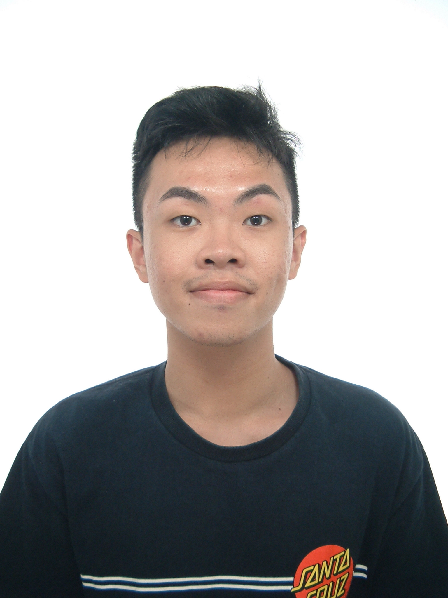
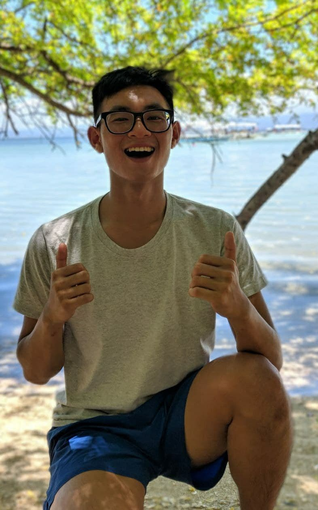
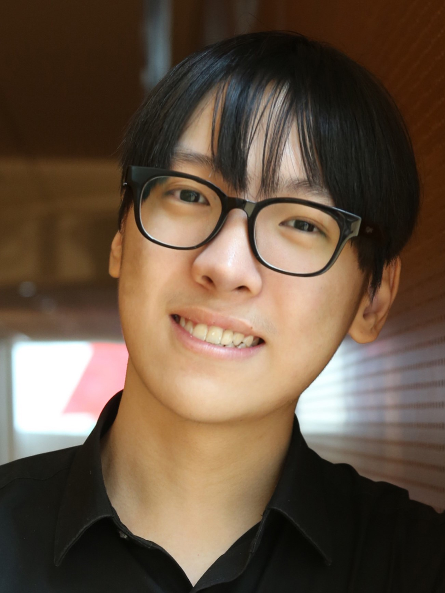
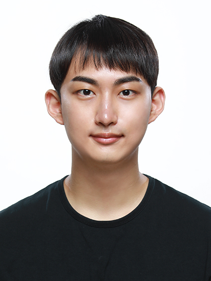

We are a team based in the [School of Computing, National University of Singapore](http://www.comp.nus.edu.sg).

You can reach us at the email `networkers@comp.nus.edu.sg`

## Project team

### Isaac Tan

[[github](https://github.com/iztanpy)]
[[portfolio](team/iztanpy.md)]

* Role: Developer
* Responsibilities: Added Procedure class 
  as well as updated and added new features

### Teo Ming Huang

[[github](http://github.com/teominghuang)]
[[portfolio](team/teominghuang.md)]

* Role: Developer
* Responsibilities: Connect Procedure to the different dependencies, and update existing AB3 commands to Networkers.

### Alexander Er

[[github](https://github.com/aceszhenwei)]
[[portfolio](team/aceszhenwei.md)]

* Role: Developer
* Responsibilities: Update existing AB3 commands to Networkers as well as documentation

### Yong Gi Roh

[[github](https://github.com/robinrojh)]
[[portfolio](team/robinrojh.md)]

* Role: Developer
* Responsibilities: Update new features and documentations, and manage UI-related issues

### JB Jungbae Kim

[[github](https://github.com/jbkim1999)]
[[portfolio](team/jbkim1999.md)]

* Role: Developer
* Responsibilities: Code Quality, Manage PRs
