* Table of Contents
{:toc}
--------------------------------------------------------------------------------------------------------------------

## **Introduction**

### **Purpose**

This developer's guide clarifies the project architecture as well as software design decisions for **Networkers**.
This guide will also look at how individual features are implemented in this project.

*Networkers* is a **desktop app for managing contacts for network technicians,
optimised for use via a Command Line Interface** (CLI) 
while still having the benefits of a Graphical User Interface (GUI).

### **Intended Audience**

The intended audience of this document would be
1. Developers who are keen to contribute to Networkers
2. Software testers who may need to understand the project
   to carry out meaningful testing.
3. Developers who are interested in learning more
   about the implementation of this project

--------------------------------------------------------------------------------------------------------------------

## **Acknowledgements**

* [addressbook 3](https://se-education.org/addressbook-level3/)

* {list here sources of all reused/adapted ideas, code, documentation, and third-party libraries -- include links to the original source as well}

--------------------------------------------------------------------------------------------------------------------

## **Setting up, getting started**

Refer to the guide [_Setting up and getting started_](SettingUp.md).

--------------------------------------------------------------------------------------------------------------------

## **Design**

:bulb: **Tip:** The `.puml` files used to create diagrams in this document can be found in the [diagrams](https://github.com/se-edu/addressbook-level3/tree/master/docs/diagrams/) folder. Refer to the [_PlantUML Tutorial_ at se-edu/guides](https://se-education.org/guides/tutorials/plantUml.html) to learn how to create and edit diagrams.

### Architecture

The ***Architecture Diagram*** given above explains the high-level design of the App.

Given below is a quick overview of main components and how they interact with each other.

**Main components of the architecture**

**`Main`** has two classes called [`Main`](https://github.com/se-edu/addressbook-level3/tree/master/src/main/java/seedu/address/Main.java) and [`MainApp`](https://github.com/se-edu/addressbook-level3/tree/master/src/main/java/seedu/address/MainApp.java). It is responsible for,
* At app launch: Initializes the components in the correct sequence, and connects them up with each other.
* At shut down: Shuts down the components and invokes cleanup methods where necessary.

[**`Commons`**](#common-classes) represents a collection of classes used by multiple other components.

The rest of the App consists of four components.

* [**`UI`**](#ui-component): The UI of the App.
* [**`Logic`**](#logic-component): The command executor.
* [**`Model`**](#model-component): Holds the data of the App in memory.
* [**`Storage`**](#storage-component): Reads data from, and writes data to, the hard disk.

**How the architecture components interact with each other**

The *Sequence Diagram* below shows how the components interact with each other for the scenario where the user issues the command `delete 1`.

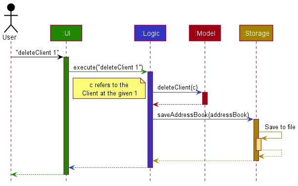

Each of the four main components (also shown in the diagram above),

* defines its *API* in an `interface` with the same name as the Component.
* implements its functionality using a concrete `{Component Name}Manager` class (which follows the corresponding API `interface` mentioned in the previous point.

For example, the `Logic` component defines its API in the `Logic.java` interface and implements its functionality using the `LogicManager.java` class which follows the `Logic` interface. Other components interact with a given component through its interface rather than the concrete class (reason: to prevent outside component's being coupled to the implementation of a component), as illustrated in the (partial) class diagram below.

The sections below give more details of each component.

### UI component

The **API** of this component is specified in [`Ui.java`](https://github.com/se-edu/addressbook-level3/tree/master/src/main/java/seedu/address/ui/Ui.java)

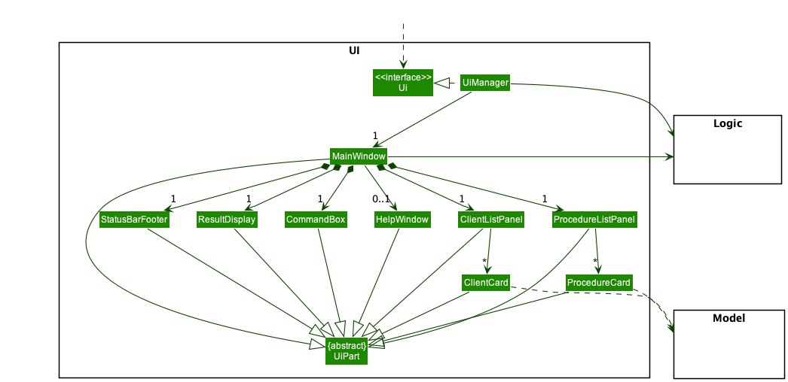

The UI consists of a `MainWindow` that is made up of parts e.g.`CommandBox`, `ResultDisplay`, `ClientListPanel`, `ProcedureListPanel`, `StatusBarFooter` etc. All these, including the `MainWindow`, inherit from the abstract `UiPart` class which captures the commonalities between classes that represent parts of the visible GUI.

The `UI` component uses the JavaFx UI framework. The layout of these UI parts are defined in matching `.fxml` files that are in the `src/main/resources/view` folder. For example, the layout of the [`MainWindow`](https://github.com/se-edu/addressbook-level3/tree/master/src/main/java/seedu/address/ui/MainWindow.java) is specified in [`MainWindow.fxml`](https://github.com/se-edu/addressbook-level3/tree/master/src/main/resources/view/MainWindow.fxml)

The `UI` component,

* executes user commands using the `Logic` component.
* listens for changes to `Model` data so that the UI can be updated with the modified data.
* keeps a reference to the `Logic` component, because the `UI` relies on the `Logic` to execute commands.
* depends on some classes in the `Model` component, as it displays `Client` object residing in the `Model`.

### Logic component

**API** : [`Logic.java`](https://github.com/se-edu/addressbook-level3/tree/master/src/main/java/seedu/address/logic/Logic.java)

Here's a (partial) class diagram of the `Logic` component:

How the `Logic` component works:
1. When `Logic` is called upon to execute a command, it uses the `AddressBookParser` class to parse the user command.
1. This results in a `Command` object (more precisely, an object of one of its subclasses e.g., `AddCommand`) which is executed by the `LogicManager`.
1. The command can communicate with the `Model` when it is executed (e.g. to add a Client).
1. The result of the command execution is encapsulated as a `CommandResult` object which is returned back from `Logic`.

The Sequence Diagram below illustrates the interactions within the `Logic` component for the `execute("delete 1")` API call.

:information_source: **Note:** The lifeline for `DeleteCommandParser` should end at the destroy marker (X) but due to a limitation of PlantUML, the lifeline reaches the end of diagram.

Here are the other classes in `Logic` (omitted from the class diagram above) that are used for parsing a user command:

How the parsing works:
* When called upon to parse a user command, the `AddressBookParser` class creates an `XYZCommandParser` (`XYZ` is a placeholder for the specific command name e.g., `AddCommandParser`) which uses the other classes shown above to parse the user command and create a `XYZCommand` object (e.g., `AddCommand`) which the `AddressBookParser` returns back as a `Command` object.
* All `XYZCommandParser` classes (e.g., `AddCommandParser`, `DeleteCommandParser`, ...) inherit from the `Parser` interface so that they can be treated similarly where possible e.g, during testing.

### Model component
**API** : [`Model.java`](https://github.com/se-edu/addressbook-level3/tree/master/src/main/java/seedu/address/model/Model.java)

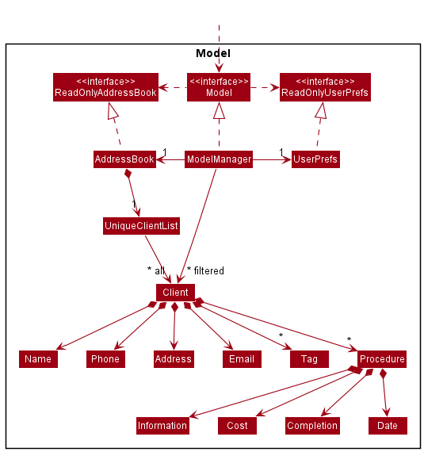

The `Model` component,

* stores the address book data i.e., all `Client` objects (which are contained in a `UniqueClientList` object).
* stores the currently 'selected' `Client` objects (e.g., results of a search query) as a separate _filtered_ list which is exposed to outsiders as an unmodifiable `ObservableList<Client>` that can be 'observed' e.g. the UI can be bound to this list so that the UI automatically updates when the data in the list change.
* stores a `UserPref` object that represents the user’s preferences. This is exposed to the outside as a `ReadOnlyUserPref` objects.
* does not depend on any of the other three components (as the `Model` represents data entities of the domain, they should make sense on their own without depending on other components)

:information_source: **Note:** An alternative (arguably, a more OOP) model is given below. It has a `Tag` list in the `AddressBook`, which `Client` references. This allows `AddressBook` to only require one `Tag` object per unique tag, instead of each `Client` needing their own `Tag` objects. 

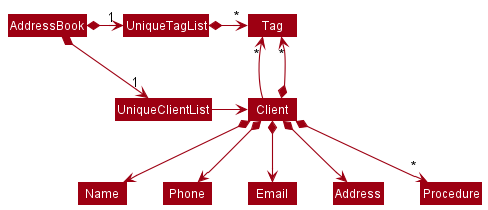

### Storage component

**API** : [`Storage.java`](https://github.com/se-edu/addressbook-level3/tree/master/src/main/java/seedu/address/storage/Storage.java)

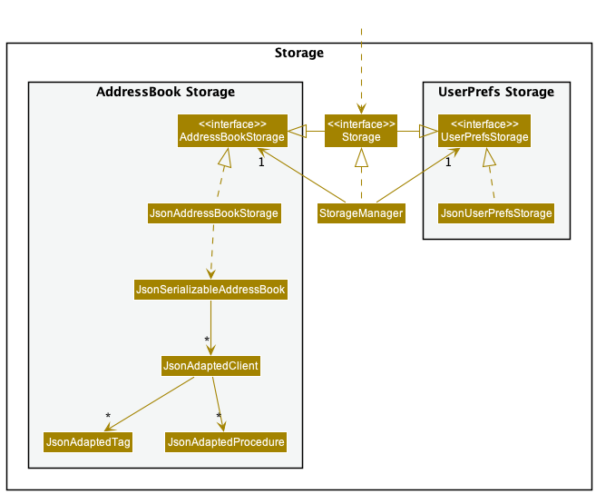

The `Storage` component,
* can save both address book data and user preference data in json format, and read them back into corresponding objects.
* inherits from both `AddressBookStorage` and `UserPrefStorage`, which means it can be treated as either one (if only the functionality of only one is needed).
* depends on some classes in the `Model` component (because the `Storage` component's job is to save/retrieve objects that belong to the `Model`)

### Common classes

Classes used by multiple components are in the `seedu.addressbook.commons` package.

--------------------------------------------------------------------------------------------------------------------

## **Implementation**

This section describes some noteworthy details on how certain features are implemented.

### Add Procedure (AddProc)

This mechanism is facilitated by `AddProcCommand`. It extends `Command` taking in a new `Procedure` and `Index` which points to the Client that it wishes to edit. It will also interact with `Storage` in order to store the information about the new Procedure added. This operation is exposed in the `Model` interface as `Model#setProcedures()`.

In general, the `addProc` command is a command that takes in a string with specified prefixes and a Client index. It will indicate new Procedures that Clients have added to their Procedure list. If an invalid command (whether by index or prefix error), a respective exception will be thrown.

The Sequence Diagram below illustrates the interactions within the `Logic` component for the `addProc` API call.:

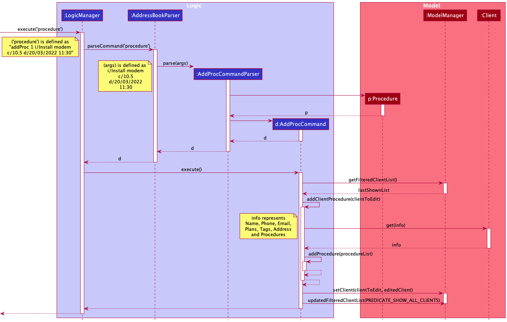

Step 1. Once the user types in the command, the `LogicManager` will be called to execute it. It will use `AddressBookParser` to parse the user command.

Step 2. This results in a new `Parser` (more precisely, an object of one of its subclasses e.g., `AddProcCommandParser`) object being constructed.

Step 3. This will result in a new `Procedure` object (based on the user inputs) and a new `Command` object (specifically `AddProcCommand`) being constructed.

Step 4. With this, `LogicManager` will call `AddProcCommand` to execute.

Step 5. Within `AddProcCommand`, it will retrieve the `Client` that needs to be added a new `Procedure` and add the new `Procedure` into its Procedure list.

Step 6. Once the `Client` has been updated to include the new `Procedure`, it will update `ModelManager` with the updated `Client` to reflect this change.

### Delete Procedures from a Client (DeleteProc)

The deleteProc mechanism is facilitated by the `DeleteProcCommandParser`.
The deleteProc mechanism allows deletion of a `Procedure` from an existing `Client` in the address book.
The deleteProc is permanently erased and the remaining `Procedure` are stored locally after.
It implements the following operations:

* `DeleteProcCommand#editClientProcedure(Client clientToEdit)` &mdash; Edit an attribute of an existing `Client` and return a new `Client`.
* `DeleteProcCommand#deleteProcedure(List<Procedure> procedureList)` &mdash; Remove a `Procedure` from the list of `Procedure`
* `Model#setClient(clientToEdit, editedClient)` &mdash; Replace the existing `Client` with its editted variant.
* `Model#updateFilteredClientList(Predicate<Client> predicate)` &mdash; Replace the existing `Client` with its editted variant in the `ObservableList`, that helps to update the UI.

The `editClientProcedure(Client clientToEdit)` operation is exposed in the `Model` interface as `Model#setProcedure()`.

Given below is an example usage scenario and how the deleteProc mechanism behaves at each step.

Step 1. The user finds the `Procedure` that the Client has using `findProc <Index>`
The UI lists all the `Procedure` associated to the Client and would like to delete one.

Step 2. The user executes `deleteProc 1 1` to delete the 1st `Procedure` associated with the 1st Client in the address book.
The `deleteProc 1 1` command calls `DeleteProcCommand#(Client clientToEdit)`, which calls the `deleteProcedure(List<Procedure procedureList)` method to remove the `Procedure` from the list.
This newly-created `Client` is saved locally through the `Model#setClient`, and displayed by updating the `UpdateFilteredClientList`.
With the `Client` saved, the address book is saved at a new state.

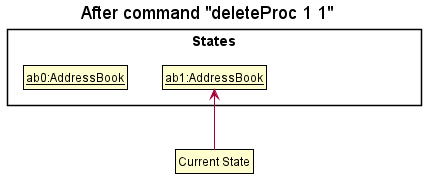

The following sequence diagram shows how this operation works.

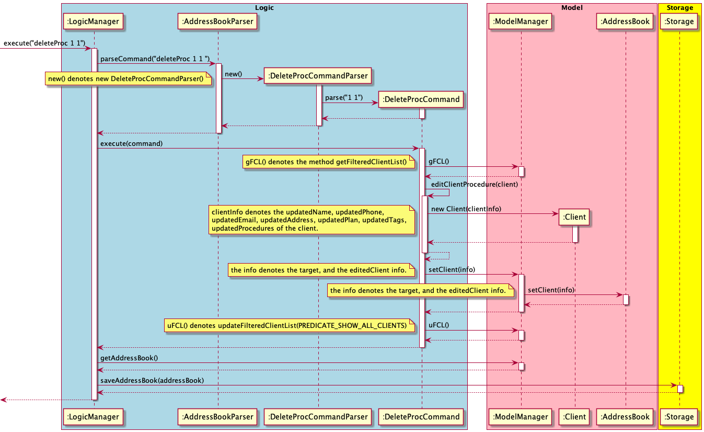

#### Design considerations:

**Aspect: Will `deleteProc` permanently delete the `Procedure`**

* **Alternative 1 (current choice):** Deletes the entire Procedure.
    * Pros: Easy to implement and uses less storage.
    * Cons: Users might find it hard to retrieve pre-existing data of the user.

* **Alternative 2:** Create a deleted status for the `Procedure` and only allow vision of undeleted `Procedure` itself.
    * Pros: User could easily retrieve previous deleted data.
    * Cons: Can get storage-expensive, which makes future parsing slower.
    
### List Procedures By Client (ListProc)

Lists the Procedures for the given input index of a Client.

If the Client doesn't have any Procedures, it prints out a different message indicating that. Otherwise, it will simply
print out the success message on result window and update the right column of the UI.

Below is the sequence diagram for executing ListProcCommand as a user.

Step 1: UI starts when the application starts.

Step 2: User calls the "listProc 1" command

Step 3: LogicManager handles the command from user

Step 4: ModelManager updates the Procedure list accordingly and returns to LogicManager

Step 5: UI takes the return value from LogicManager and updates the UI

**Why did I implement ListProcCommand this way?**

In other functions like find, it doesn't seem that an explicit UI update was necessary.
However, even when I update the Procedure list correctly, the UI didn't get updated automatically.
Therefore, after correctly updating the Procedure list, I update the UI in MainWindow executeCommand method
by creating a new ProcedureListPanel.

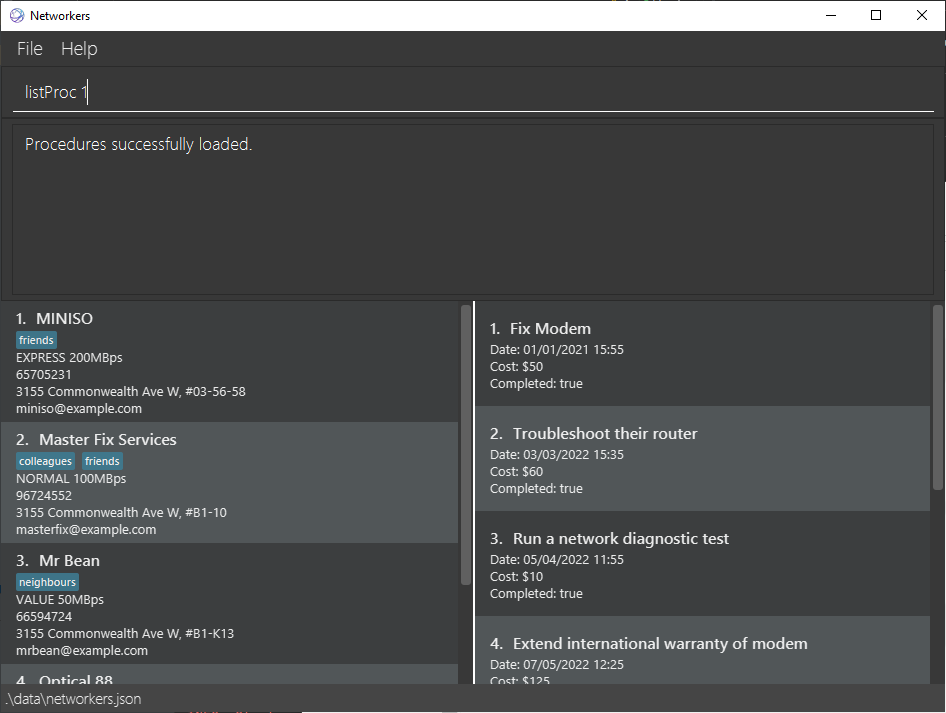

An additional point: listProc method is called in the UI before the user can input anything to display
the first Client's Procedures. This allows the user to understand exactly what the right column is for.

### List Procedures By Date (ListProcOn)

#### Implementation

`ListProcOn` command takes in a date (in the form of dd/mm/yyyy) and returns the Procedures and the Clients' information attached to each of the Procedure that a technician should carry out on that requested date.   
Like other Commands, user input is first parsed by `AddressBookParser`, which is then directed to `ListProcOnCommandParser`, parsing the date into `DateWithoutTime` class, and finally passing down to `ListProcOnCommand` for execution.
Description of `DateWithoutTime` shall be omitted here since the class name is self-explanatory. The below simplified class diagram illustrates such dependencies.  

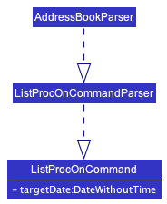

`ListProcOnCommand` will then be executed, returning `CommandResult` that can be displayed to the users. The following sequence diagram illustrates the execution of `ListProcOnCommand`.

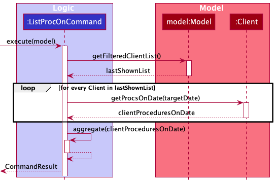

In short, the command will ask for all the Clients list from the `Model`, and each Client is responsible for returning Procedures that is scheduled on `targetDate`.
`ListProcOnCommand` aggregates them altogether and returns `CommandResult` for subsequent UI operations.

#### Design considerations:

**Aspect: How to connect each Procedure to its associated Client:**  
This aspect needs to be considered since it is not sufficient just to display all the Procedures for a given date; the user must know about the Procedure's associated Client as well for the feature to be useful.

* **Alternative 1 (current choice):** Uses a `Pair` container to contain both Procedure and its associated Client when aggregating.
    * Pros: No need to create an additional attribute for Procedure connecting to its associated Client.
    * Cons: May have performance issues in terms of memory usage, as `ListProcOnCommand` needs to save both the Procedure and its associated Client.

* **Alternative 2:** Attach an attribute to a Procedure that points to its associated Client class.
    * Pros: Easy to implement. (Simply an additional line of code)
    * Cons: Cost-related issues (e.g. time consumed for additional integration tests between Procedure and Client, as well as changes to existing tests and sample data)

### Calculate Cost By Date (Calculate)

It gives functionality to the cost attribute within the Procedure class by calculating total `Cost` from all Procedures on a specified date.
This provides an instance of total `Cost`, which is not stored locally.
It implements the following operation:

`Networkers#calculateCost(String date)` — returns total `Cost` from all Procedures on a specified date.

The operation is exposed in the `Model` interface as `Model#calculateCost()`.

Given below is an example usage scenario and how the calculateCost feature behaves at each step.

Step 1. The user would already have Procedures attributed to different Clients in `Networkers`
and would want to calculate all the costs of Procedures conducted today (22/03/2022)

Step 2. The user executes `calculate 22/03/2022` to calculate cost of all Procedures on `22/03/2022`.

The following sequence diagram shows how this operation works:

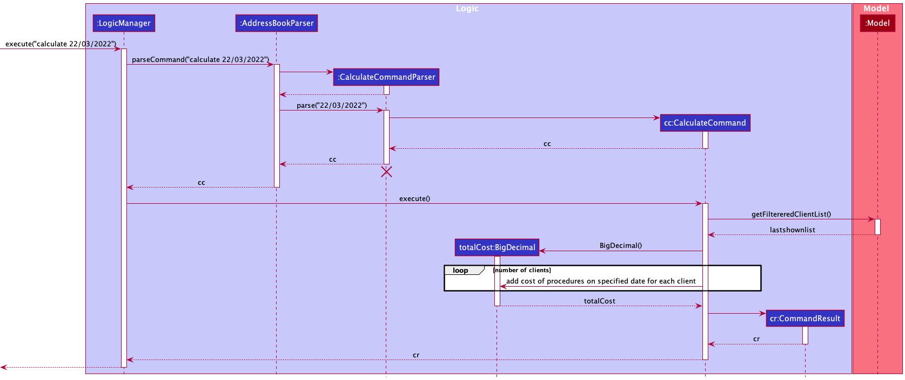

:information_source: **Note:** The lifeline for `CalculateCommandParser` should end at the destroy marker (X)
but due to a limitation of PlantUML, the lifeline reaches the end of diagram.

1. The arguments passed to the logic manager will be parsed by the AddressBookParser class.
2. If the given arguments are valid, further parsing will be carried out by the CalculateCommandParser.
3. If further parsing is successful, a new CalculateCommand object will be returned
##### In these parsers, invalid arguments will result in a ParseException.

A valid argument consists of 2 sections:
1. valid command `calculate`
2. valid date, `22/03/2022`

A date is only valid if it follows the "dd/MM/yyyy" format and consists of a legitimate date,
taking leap years into account

--------------------------------------------------------------------------------------------------------------------

## **Documentation, logging, testing, configuration, dev-ops**

* [Documentation guide](Documentation.md)
* [Testing guide](Testing.md)
* [Logging guide](Logging.md)
* [Configuration guide](Configuration.md)
* [DevOps guide](DevOps.md)

--------------------------------------------------------------------------------------------------------------------

## **Appendix: Requirements**

### Product scope

**Target user profile**:

* Has a need to manage a significant number of businesses (Client(s))
* Has a need to manage different network-related Procedures for his/her Client(s), such as maintaining and repairing network components like routers and modems
*  Prefers desktop apps over other types
*  Can type fast
*  Prefers typing to mouse interactions
*  Is reasonably comfortable using CLI apps

**Value proposition**:
* Manage Clients and the respective Procedures faster than a typical mouse/GUI driven app
* Keep important information regarding the user’s business in one platform to manage Clients and past, current, and future Procedures more easily

### Noteworthy user stories

Priorities: High (must have) - `* * *`, Medium (nice to have) - `* *`, Low (unlikely to have) - `*`

| Priority | As a ...                                   | I want to ...                                                           | So that I can ...                                                             |
|----------|--------------------------------------------|-------------------------------------------------------------------------|-------------------------------------------------------------------------------|
| `* * *`  | user                                       | add a Client                                                            | add a Client to my contacts.                                                  |
| `* * *`  | user                                       | delete a Client                                                         | delete an existing Client when the Client no longer engages with the company. |
| `* * *`  | user                                       | add a Procedure to a Client                                             | add a Procedure associated with the Client.                                   |
| `* * *`  | user                                       | delete a Procedure from an existing Client                              | delete a Procedure from the existing Client.                                  |
| `* * *`  | user with many Clients in the address book | view all of my Client(s’) contact information                           | have a brief idea about how many Client(s) I have at the moment.              |
| `* * `   | user with many Procedures to perform       | view all of my Procedures scheduled on a specified day                  | have a brief idea of which Procedures to perform at a given day.              |
| `* * `   | user making expense reports                | calculate the total cost of all Procedures performed on a specified day | make an expense report to the company.                                        |

### Use cases

(For all use cases below, the System is the Networkers and the Actor is the User, unless specified otherwise)

**Use case 1: Add a Client**

**MSS**

1. User requests to list Client(s). (UC5)
2. User requests to add a Client to the list by specifying its name, number, address, subscription plan, and tag.
3. Networkers adds the Client.  
Use case ends.

**Extensions**

* 2a. The name, number, address, or plan is empty.
  * 2a1. Networkers shows an error message.  
  Use case resumes at step 1.

* 2b. There is an identical Client already existing in the list.
  * 2b1. Networkers shows an error message.  
  Use case resumes at step 1.

**Use case 2: Delete a Client**

**MSS**

1. User requests to list Client(s). (UC5)
2. User sends in a command to delete the Client from the list.
3. Networkers deletes existing Client.  
Use case ends.

**Extensions**

* 2a. The user requests to delete a Client out of index.
  * 2a1. Networkers shows an error message.  
  Use case resumes at step 1.

**Use case 3: Add a Procedure to a Client**

**MSS**

1. User requests to list Client(s). (UC5)
2. User requests to add a Procedure by specifying its related information, cost, and date and time, to a specified Client in the list.
3. Networkers adds the Procedure associated with the Client.  
Use case ends.

**Extensions**

* 2a. The User requests to add a Procedure to a Client out of index.
  * 2a1. Networkers shows an error message.  
  Use case resumes at step 1.

* 2b. The related information, cost, or date and time is empty.
  * 2b1. Networkers shows an error message.  
  Use case resumes at step 1.

* 2c. The specified Client already has an identical Procedure in its Procedure list.
  * 2c1. Networkers shows an error message.  
  Use case resumes at step 1.

**Use case 4: Delete a Procedure from a Client**

**MSS**

1. User requests to list Client(s). (UC5)
2. User sends in a command to delete a specified Procedure from a specified Client in the list.
3. Networkers deletes the Procedure from the Client.  
Use case ends.

**Extensions**

* 2a. The specified Procedure is out of index.
  * 2a1. Networkers shows an error message.  
  Use case resumes at step 1.

* 2b. The specified Client is out of index.
  * 2b1. Networkers shows an error message.  
  Use case resumes at step 1.

* 2c. The User requests to delete a non-existing Procedure from an existing Client.
  * 2c1. Networkers shows an error message.  
  Use case resumes at step 1.

* 2d. The User requests to delete an existing Procedure from a non-existing Client.
  * 2d1. Networkers shows an error message.  
  Use case resumes at step 1.

**Use case 5: List Client(s) in Networkers**

**MSS**

1. User requests to list Client(s).
2. Networkers displays the list of Client(s).  
Use case ends.

**Use case 6: Listing all the Procedures that are on a specified day.**

**MSS**

1. User sends in a command to list all the Procedures with a specified date.
2. Networkers displays the Procedures along with the location of the Client site.  
Use case ends.

**Extensions**

* 1a. The date is invalid.
  * 1a1. Networkers shows an error message.  
  Use case ends.

**Use case 7: Calculating the cost of all procedures on a specified day**

**MSS**

1. User sends in a command to sum the cost of all Procedures on a specified date.
2. Networkers returns the total cost of all associated Procedures.  
Use case ends.

**Extensions**

* 1a. The date is invalid
  * 1a1. Networkers shows an error message.  
  Use case ends.

* 1b. There are no Procedures on the specified date.
  * 1b1. Networkers returns a cost of $0.  
  Use case ends.

### Non-Functional Requirements
1. Should work on any mainstream OS as long as it has Java 11 or above installed.
2. Should be able to hold up to 1000 Client(s) without a noticeable sluggishness in performance for typical usage.
3. A User with above average typing speed for regular English text (i.e. not code, not system admin commands) should be able to accomplish most of the tasks faster using commands than using the mouse.
4. The system should respond within two seconds.

*{More to be added}*

### Glossary

* **Mainstream OS**: Windows, Linux, Unix, OS-X
* **Client**: Refers to a business entity that the User is responsible for network-related Procedures
* **Contact**: Refers to information for a Client, including its business name, phone number, and address.
* **Procedure**: Refers to a network-related task that a User performs for a Client, such as fixing a router and setting up intranet.

--------------------------------------------------------------------------------------------------------------------

## **Appendix: Instructions for manual testing**

Given below are instructions to test the app manually.

:information_source: **Note:** These instructions only provide a starting point for testers to work on;
testers are expected to do more *exploratory* testing.

### Launch and shutdown

1. Initial launch

    1. Download the jar file and copy into an empty folder

    1. Double-click the jar file Expected: Shows the GUI with a set of sample contacts. The window size may not be optimum.

1. Saving window preferences

    1. Resize the window to an optimum size. Move the window to a different location. Close the window.

    1. Re-launch the app by double-clicking the jar file. 
       Expected: The most recent window size and location is retained.

1. _{ more test cases … }_

### Deleting a Client

1. Deleting a Client while all Clients are being shown

    1. Prerequisites: List all Clients using the `list` command. Multiple Clients in the list.

    1. Test case: `delete 1` 
       Expected: First contact is deleted from the list. Details of the deleted contact shown in the status message. Timestamp in the status bar is updated.

    1. Test case: `delete 0` 
       Expected: No Client is deleted. Error details shown in the status message. Status bar remains the same.

    1. Other incorrect delete commands to try: `delete`, `delete x`, `...` (where x is larger than the list size) 
       Expected: Similar to previous.

1. _{ more test cases … }_

### Saving data

1. Dealing with missing/corrupted data files

    1. _{explain how to simulate a missing/corrupted file, and the expected behavior}_

1. _{ more test cases … }_
