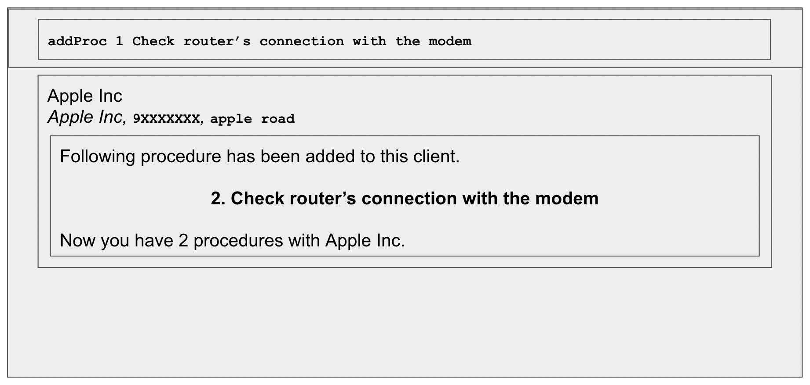

### Add a Procedure to a Client: `addProc`

Adds a specified procedure to a specified client list in the contact book.

**Format:** `addProc <Client Index> <Procedure>`
* `addProc` refers to the command of adding a procedure to the client at the specified Index.
* `<Client Index>` refers to the index number shown in the displayed client list. The index **must be** a positive integer 1, 2, 3, …​
* `<Procedure>` refers to the tasks or problems that need to be addressed in the future visits to the client’s business sight.
  * Note that a client’s list of procedures is a numbered list. A new procedure will be added on to the existing numbered list (to the last index).

**Example:**  
Non-GUI Format:
* `addProc 1 Check router’s connection with the modem`
  * In the case that the 1st client already has existing procedures, `Check router’s connection with the modem` procedure will appear to be the last procedure in that client’s procedure list.

GUI Format:

### View All Clients and Procedures: `list`

Lists out all the clients and their respective procedures saved. 
This feature will be used to show clients on GUI. No arguments required.
Example: 
- User: list
- Terminal returns: 
1. Apple, 9XXXXXXX, Apple Road
    1. Fixed the intranet issue
    2. Replace router in 3rd floor
2. Singtel, 8XXXXXXX, Singtel Road
    1. Cable split
    2. Reconnected broadband services

##Command Summary
| Command | Syntax | Example |
| ----- | ----- | ----- |
| Add Client | _addClient n/\<NAME> p/\<PHONE_NUMBER> a/\<ADDRESS>_| _addClient n/Apple Inc p/9XXXXXXX a/apple road_ |
| Delete Client | _deleteClient \<INDEX>_ | deleteClient 1 |
| Add Procedure | _addProc \<CLIENT INDEX> \<Procedure>_ | _addProc 1 Check router’s connection with the modem_ |
| Delete Procedure | _deleteProc \<CLIENT INDEX> \<PROCEDURE INDEX>_ | _deleteProc 1 3_ |
| List All Clients | _list_ | _list_ |
