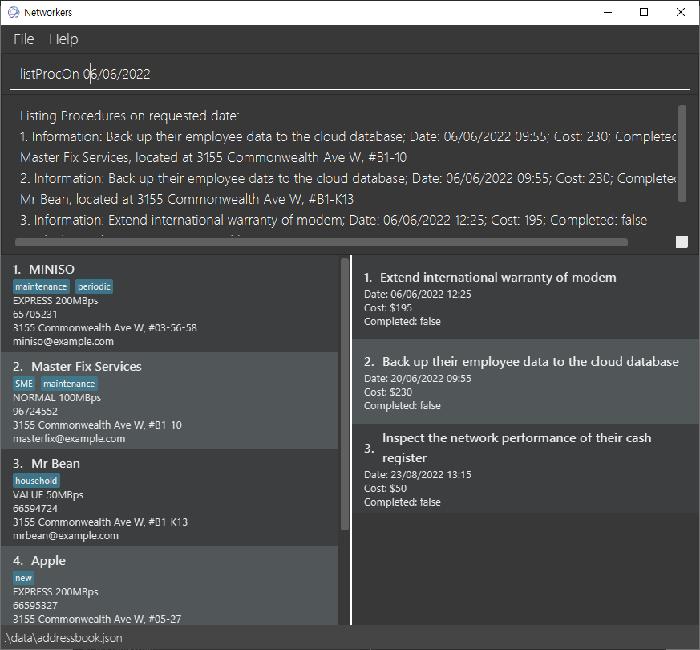

* Table of Contents
{:toc}
--------------------------------------------------------------------------------------------------------------------

*Networkers* is a **desktop app for managing contacts for network technicians,
optimised for use via a Command Line Interface** (CLI)
while still having the benefits of a Graphical User Interface (GUI).
If you can type fast, Networkers can get your contact management tasks
done faster than traditional GUI apps.

--------------------------------------------------------------------------------------------------------------------
## Quick start

1. Ensure you have Java `11` or above installed in your Computer.

2. Download the latest `networkers.jar` from [here](https://github.com/AY2122S2-CS2103T-W13-1/tp/releases).

1. Copy the file to the folder you want to use as the _home folder_ for your networkers.

1. Double-click the file to start the app. The GUI similar to the below should appear in a few seconds. Note how the app contains some sample data.<br/>
   

1. Type the command in the command box and press Enter to execute it. e.g. typing **`help`** and pressing Enter will open the help window.<br/>
   Some example commands you can try:

  * **`list`** : Lists all contacts.

  * **`addClient`**`n/Apple p/91234561 e/apple@example.com a/311, Bedok Ave 3, #01-15 l/Plan 50GBps t/corporate` :
    Adds a Client named `Apple` to the Networkers.
    
  * **`deleteClient`**`3` : Deletes the 3rd Client shown in the current list.

  * **`listProc`**`1` : 
    Lists the Procedures associated with the 1st Client shown in the current list.

  * **`mark`**`1 1` : Marks the first Procedure in the first Client as complete.

  * **`clear`** : Deletes all Client.

  * **`exit`** : Exits the app.
  
--------------------------------------------------------------------------------------------------------------------
## UI Guide


### Using the UI

To use our program, you need to type your commands into the command box as shown in the above image.
After typing, press enter: if the correct format is entered, it will execute the command, or else it will guide you 
in rectifying the error.

> :bulb: **Tip:** Procedures of the first Client in the list will be displayed on the Procedure panel!

## Features
For each of the features section, we have divided it into Format, Note, and Example subsections.
Format subsection mainly discusses how the command should be structured when typing it to the Command Line Interface.
Note is also an optional subsection that contains more information about the command, but may not be directly connected to the format of the command.
Example is an optional subsection illustrate how our application responds after typing in and executing the example commands.

### Notes about command formats:
- Words in `UPPER_CASE` are the parameters to be supplied by the user.
  For example, in `addClient n/NAME`, `NAME` is a parameter that can be used as `addClient n/John Doe`.

- When more than 1 parameter from the user is required, parameters will be separated with the use  of 
  indicators, in the form of `x/xxxxx`
  For example, in the add command, since more than one parameter needs to be specified, the command takes
  the form of `n/NAME p/PHONE_NUMBER e/EMAIL a/ADDRESS l/PLAN [t/TAG]`. 

- Items in square brackets are optional.
  For example, `find KEYWORD [MORE_KEYWORDS]` can be used as `find Apple Inc`.

- All indexes are integer based, in which the maximum value is 2147483647 (2<sup>31</sup> - 1), as specified by the Java language.

### Add a Client: `addClient`

Add your Client to Networkers. The Client will initially start off with an empty Procedure list.

**Format:** `addClient n/NAME p/PHONE_NUMBER e/EMAIL a/ADDRESS l/PLAN [t/TAG]...`
- `addClient` refers to the command of adding a Client.

- Equality checks for this command only come into effect if `ADDRESS` attribute is identical, including the presence of whitespaces.
  - Having two whitespaces will be treated differently from having one whitespace.
- There exists some fields that are mandatory for this function. These fields include their name, phone_number, address and a (subscription) plan.

**Note:** <br/>
- You can insert any information for the plan attribute. This behavior is intended because there are varying formats specified by the different telecommunications company.

> :bulb: **Tip:** Our User Guide uses PLAN NAME + BANDWIDTH for inserting plan attribute, such as PLAN 50GBPs. But feel free to customize!

**Example:** <br/>
In Command Line Interface (CLI):
- `addClient n/Apple p/91234561 e/apple@example.com a/311, Bedok Ave 3, #01-15 l/Plan 50GBps t/corporate`
  - This triggers the addition of a Client into your Client list.
  - Result shows: `New client added: Apple; Phone: 91234561; Email: apple@example.com; Address: 311, Bedok Ave 3, #01-15; Plan: Plan 50GBps; Tags: [corporate]`

In Application: 

### Delete a Client: `deleteClient`

Deletes a specified Client in Networkers.

**Format:** `deleteClient <CLIENT INDEX>`
- Deletes an existing Client at the specified index in your Client list.
- `<CLIENT INDEX>` refers to the ordering number shown in your displayed Client list.
  - The index **must be** a positive integer 1, 2, 3, …
- The largest Client index that you can assess is 2147483647.

**Example:** <br/>
In Command Line Interface (CLI):
- `deleteClient 5` 
  - This triggers the deletion of the first Client in your Client list. 
  - ❗ When you delete a Client, you will delete the Procedures that are tagged to them as well.
  - Result shows: `Deleted Client: Apple; Phone: 91234561; Email: apple@example.com; Address: 311, Bedok Ave 3, #01-15; Plan: Plan 50GBps; Tags: [corporate]`

In Application: 

### Edit a Client: `edit`

Edits a Client in Networkers.

**Format:** `edit <CLIENT INDEX> [n/NAME] [p/PHONE] [e/EMAIL] [a/ADDRESS] [l/PLAN] [t/TAG]...`
- `edit` refers to the command to edit a Client in Networkers.
- `<CLIENT INDEX>` refers to the index number shown in the displayed Client list. 
  - The index **must be** a positive integer 1, 2, 3, …
- `[n/NAME]` refers to an optional field of editing your Client's name.
- `[p/PHONE]` refers to an optional field of editing your Client's contact number.
- `[e/EMAIL]` refers to an optional field of editing your Client's email.
- `[a/ADDRESS]` refers to an optional field of editing your Client's address.
- `[l/PLAN]` refers to an optional field of editing your Client's subscription plan.
- `[t/TAG]` refers to an optional field of editing your Client's tag.
- In order to trigger this command, at least one of the following fields must be edited: `name`, `phone`, `email`, 
`address`, `plan`, `tag`.
- ❗ Note that by editing your client's details, you will be overwriting their existing data.

**Example:** <br/>
In Command Line Interface (CLI):
- `edit 4 n/Apple`
  - This triggers the editing of the indicated Client.
  - Result shows: `Edited Client: Apple; Phone: 66595327; Email: optical88@example.com; Address: 3155 Commonwealth Ave W, #05-27; Plan: EXPRESS 200MBps; Tags: [family]`

In Application: 

### Add a Procedure to a Client: `addProc`

Adds a specified Procedure to a specified Client in your display Client list.

**Format:** `addProc <CLIENT INDEX> i/INFORMATION c/COST d/DATE_TIME`
- `addProc` refers to the command of adding a Procedure to the Client at the specified index.
- `<CLIENT INDEX>` refers to the index number shown in the displayed Client list. 
  - The index **must be** a positive integer 1, 2, 3, …
- `INFORMATION` refers to the tasks or problems that need to be addressed on the Client’s business site.
- `COST` is the cost required for the Procedure.
- `DATE_TIME` is the date and time that the Procedure takes place. It accepts inputs in the form of `dd/MM/YYYY HH:MM`, e.g. 20/03/2022 11:30.
- If the specified Client already has an identical Procedure, the application will inform you that the Procedure has already been added.
  - An identical Procedure refers a Procedure that contains the exact information, date and time, and cost.

**Note:** <br/>
- If you were viewing the Procedures of another Client when adding a Procedure, after execution of the command, it will show the list of Procedures for the Client that now has this newly added Procedure.
- A new Procedure will be auto-sorted based on the date when the Procedure takes place, in ascending order.
- It is perfectly valid to add Procedures that fall on the exact date and time.
  - This is because some Procedures can be done concurrently through remote control.
- It is perfectly valid to add in Procedures that had occurred in the past.
  - This is because we have learned some technicians wish to add in past Procedures just for their own record.

**Example:** <br/>
In Command Line Interface (CLI):
- `addProc 1 i/Install modem c/10.5 d/20/03/2022 11:30`
  - This triggers the adding of the Procedure to the first Client.

In Application: 

### Delete a Procedure from the Client: `deleteProc`

Deletes a Procedure associated with your Client. This is important as it allows you to maintain and make changes to the database.

**Format:** `deleteProc <CLIENT INDEX> <PROCEDURE INDEX>`
- `deleteProc` refers to the command of deleting a Procedure from the Client at the specified index.
- `<CLIENT INDEX>` refers to the index number shown in the displayed Client list. 
  - The index **must be** a positive integer 1, 2, 3, ...
- `<PROCEDURE INDEX>` refers to the index number of a Procedure from a specified Client's list of Procedures. 
  - The index **must be** a positive integer 1, 2, 3, ...
- A Client’s list of Procedures is also a numbered list.

**Note:** <br/>
- If you were viewing the Procedures of other Client when deleting a Procedure to a different Client, after execution of the command, it will show the list of Procedures for the Client that now has this newly added Procedure.

**Example:** <br/>
In Command Line Interface (CLI):
- `deleteProc 1 3`
  - Result shows: `Current Procedure List: [Information: Install modem; Date: 20/03/2022 11:30; Cost: 10.5; Completed: false]`

Before Command:


After Command:


### Edit a Procedure of your Client: `editProc`

Edits an existing Procedure that belongs to an existing Client. This feature allows you to edit the main details related to the Procedure.
The main details include the information, the date, and the cost of the Procedure.

**Format:** `editProc <CLIENT INDEX> <PROCEDURE INDEX> [i/INFORMATION] [d/DATE] [c/COST]`
- `editProc` refers to the command to edit a Procedure belonging to your Client.
- `<CLIENT INDEX>` refers to the ordering number of the Client displayed on the Client screen. 
  - The index **must be** a positive integer 1, 2, 3, ...
- `<PROCEDURE INDEX>` refers to the ordering number of the Procedure displayed on the Procedure screen (that is associated with a Client). 
  - The index **must be** a positive integer 1, 2, 3, ...
- `[i/INFORMATION]` refers to the informational detail of the Procedures in subsequent servicing trips. 
- `[d/DATE]` refers to the date of the subsequent servicing trip of your Client.
- `[c/COST]` refers to the cost incurred from executing the Procedure that will be charged to your Client.
- Either the information field, the date field, or the cost field **must be** filled up for this feature to run.

**Note:** <br/>
- If you were viewing the Procedures of another Client when editing a Procedure, after execution of the command, it will show the list of Procedures for the Client that now has this newly added Procedure.

**Example:** <br/>
In Command Line Interface (CLI):
- `editProc 1 2 i/Fix Router d/31/03/2022 09:50 c/67.25`
  - Result shows: `Edited Procedure: Information: Fix Router; Date: 31/03/2022 09:50; Cost: 67.25; Completed: true, from Client MINISO; Email: miniso@example.com`

Before Command: 


### View All Clients: `list`

Lists out all the Clients saved in your database. This feature will be used to display all the Clients added to the application. 
No secondary information is required.

**Format:** `list`
- `list` refers to the command to list all Clients saved in your database.

**Example:** <br/>
In Command Line Interface (CLI):
- `list`
  - Result shows: `Listed all clients.`

**Note:** <br/>
- After using the `find` command, you can use this feature to see all the Clients again.

In Application: 

### View All Procedures of a Client: `listProc`

Lists out all the Procedures related to a Client.

**Format:** `listProc <CLIENT INDEX>`
- `listProc` refers to the command to list all the Procedures related to an existing Client. 
- `<CLIENT INDEX>` refers to the ordering number of the Client displayed on the Client screen. 
  - The index **must be** a positive integer 1, 2, 3, ...

**Example:** <br/>
- `listProc 3`
  - Result shows: `Procedures successfully loaded.`

In Application: 

### View all Procedures scheduled on a specified date: `listProcOn`

Lists out all Procedures, including the associated Client as per Procedure, that are scheduled on a specified date.

**Format:** `listProcOn <DATE>`
- `listProcOn` refers to the command of listing out all Procedures on a specified date.
- `DATE` is in the format of dd/MM/YYYY, e.g. 26/03/2022.
  - Error will be thrown if the date is invalid.

**Example:** <br/>
In Command Line Interface (CLI):
- `listProcOn 06/06/2022`
  - Result shows: 
```
  Listing Procedures on requested date:
  1. Information: configure internet settings; Date: 26/03/2022 11:30; Cost: 10.50; Completed: false
   MINISO, located at 3155 Commonwealth Ave W, #03-56-58
  2. Information: configure POS connections; Date: 26/03/2022 12:00; Cost: 23.50; Completed: false
   Master Fix Services, located at 3155 Commonwealth Ave W, #B1-10
```
> :bulb: **Tip:** You can enlarge the result box by enlarging the window vertically!

In Application: 


### Calculate the cost of all Procedures on a specified date: `calculate`

Calculates the cost of all Procedures that happen at any time on a specified date.

**Format:** `calculate <DATE>`
- `calculate` refers to the command of calculating cost of all Procedures on a specified date.
- `DATE` is in the format of dd/MM/YYYY, e.g. 23/03/2022. 
  - Error will be thrown if the date is invalid.

**Example:** <br/>
In Command Line Interface (CLI):
- `calculate 06/06/2022`
  - Result shows: `Total Cost:$655.00`

In Application: 

### Marking a Procedure of a Client as Completed: `mark`

Marks the target Client's target Procedure as completed.

**Format:** `mark <CLIENT INDEX> <PROCEDURE INDEX>`
- `mark` is the command word for this command.
- `<CLIENT INDEX>` refers to the ordering number of the Client displayed on the Client screen. 
  - The index **must be** a positive integer 1, 2, 3, ...
- `<PROCEDURE INDEX>` refers to the ordering number of the Procedure displayed on the Procedure screen. 
  - The index **must be** a positive integer 1, 2, 3, ...

**Example:**

In Command Line Interface (CLI):
- `mark 1 5`
    - Result shows: `Procedure successfully marked as complete.`

In Application: 

### Unmarking a Procedure of a Client: `unmark`

Marks the target Client's target Procedure as not complete.

**Format:** `unmark <CLIENT INDEX> <PROCEDURE INDEX>`
- `unmark` is the command word for this command.
- `<CLIENT INDEX>` refers to the ordering number of the Client displayed on the Client screen. 
  - The index **must be** a positive integer 1, 2, 3, ...
- `<PROCEDURE INDEX>` refers to the ordering number of the Procedure displayed on the Procedure screen. 
  - The index **must be** a positive integer 1, 2, 3, ...

**Example:**

In Command Line Interface (CLI):
- `unmark 1 5`
    - Result shows: `Procedure successfully unmarked.`

In Application: 

### Locating Clients by Name: `find`

Finds Clients whose names contain any of the given keywords.

**Format:** `find KEYWORD [MORE_KEYWORDS]`
- The search is case-insensitive. e.g. `apple inc` will match `Apple Inc`
- The order of the keywords does not matter. e.g. `Inc Apple` will match `Apple Inc`
- Only the name is searched.
- Only full words will be matched e.g. `App` will not match `Apple Inc`
- Clients matching at least one keyword will be returned. e.g. `Inc` will return `Apple Inc`, `Google Inc`

**Example:** <br/>
In Command Line Interface (CLI):
- `find Fix`
  - Result shows: `1 client(s) listed!`

In Application: 

### Clear All Clients: `clear`

Clears all Clients and their respective Procedures currently recorded in Networkers.

**Format:** `clear`
- `clear` refers to the command of clearing all Clients and their respective Procedures in the application.

**Example:** <br/>
In Command Line Interface (CLI):
- `clear`
  - Result shows: `Address book has been cleared!`

In Application: 

### Exiting the program: `exit`

Exits the program.

**Format**: `exit`

## Command Summary

| Command                                         | Syntax                                                                                                          | Example                                                  |
|-------------------------------------------------|-----------------------------------------------------------------------------------------------------------------|----------------------------------------------------------|
| Add Client                                      | `addClient n/<NAME> p/<PHONE_NUMBER> a/<ADDRESS> l/<PLAN>`                                                      | `addClient n/Apple Inc p/9XXXXXXX a/apple road l/50MBps` |
| Delete Client                                   | `deleteClient <INDEX>`                                                                                          | `deleteClient 1`                                         |
| Edit Client                                     | `edit <CLIENT INDEX> (must be a positive integer) [n/NAME] [p/PHONE] [e/EMAIL] [a/ADDRESS] [l/PLAN] [t/TAG]...` | `edit 1 n/Apple`                                         |
| Add Procedure                                   | `addProc <CLIENT INDEX> i/INFORMATION c/COST d/DATE_TIME`                                                       | `addProc 1 i/Install modem c/10.5 d/20/03/2022 11:30`    |
| Delete Procedure                                | `deleteProc <CLIENT INDEX> <PROCEDURE INDEX>`                                                                   | `deleteProc 1 3`                                         |
| Edit Procedure                                  | `editProc <CLIENT INDEX> <PROCEDURE INDEX> [i/INFORMATION] [d/DATE] [c/COST]`                                   | `editProc 1 2 i/Fix Router d/31/03/2022 09:50 c/67.25`   |
| List All Clients                                | `list`                                                                                                          | `list`                                                   |
| List All Procedures                             | `listProc <CLIENT INDEX>`                                                                                       | `listProc 1`                                             |
| List All Procedures on Specified Date           | `listProcOn <DATE>`                                                                                             | `listProcOn 23/05/2022`                                  | 
| Calculate Cost of Procedures (on specific date) | `calculate <DATE>`                                                                                              | `calculate 23/02/2022`                                   |
| Clear All Clients                               | `clear`                                                                                                         | `clear`                                                  |
| Find Clients by Keyword                         | `find KEYWORD [MORE_KEYWORDS]`                                                                                  | `find Apple Inc`                                         |
| Mark Procedure as complete                      | `mark <CLIENT INDEX> <PROCEDURE INDEX>`                                                                         | `mark 1 1`                                               |
| Unmark completed Procedure                      | `unmark <CLIENT INDEX> <PROCEDURE INDEX>`                                                                       | `unmark 1 1`                                             |
| Exit program                                    | `exit`                                                                                                          | `exit`                                                   |

## FAQ

### Why is The Command Not Working?

There are several cases in which you might face errors when entering a command:

- Typing in the command word wrongly (e.g. typing `lisst` instead of `list`)
- Typing in wrong number of inputs (e.g. typing `deleteClient` or `deleteClient 5 2` instead of `deleteClient 2`)
- Typing in letters for numbers or vice versa (e.g. typing `listProc hello` instead of `listProc 1`)
- You entered the correct command but wrong inputs (e.g. typing `deleteProc 1 10` when there is no 10th Client)

The corresponding error messages will be displayed in the result box, so do take a look at them.
