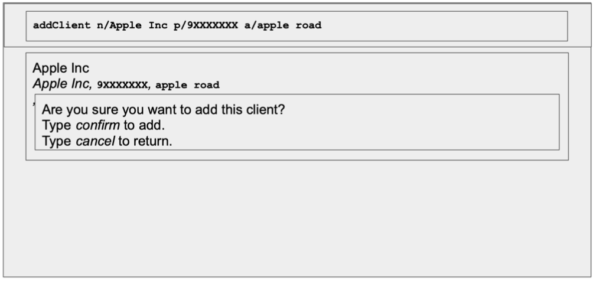
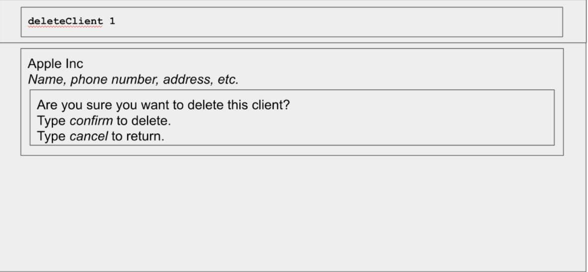
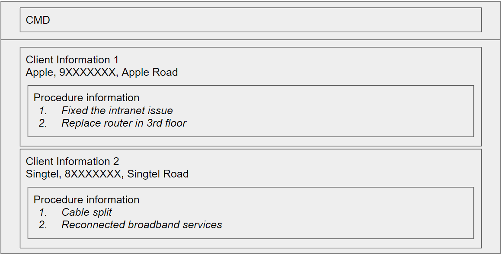

*Networkers* is a **desktop app for managing contacts for networks, 
optimised for use via a Command Line Interface** (CLI) 
while still having the benefits of a Graphical User Interface (GUI). 
If you can type fast, Networkers can get your contact management tasks 
done faster than traditional GUI apps.

- **Features (v1.2)**
  1. Add a client
  2. Delete a client
  3. Add a procedure to the client
  4. Delete a procedure from the client
  5. View all clients and associated procedures in the client
- **Command Summary**

--------------------------------------------------------------------------------------------------------------------

## Features

### Add a Client: `addClient`

Adds a Client with an empty procedure list to the address book

Format: `add n/NAME p/PHONE_NUMBER e/EMAIL a/ADDRESS [t/TAG]...`
 - `addClient` refers to the command of adding a client to the address book
 - Mandatory details include a name, phone_number and an address for the client

Examples:

Non GUI format:
-  User: `addClient n/Apple Inc p/9XXXXXXX a/apple road`
   
   Terminal returns: `Added client apple inc to the tasklist`

GUI format:
    

### Deleting a client: `deleteClient`

Deletes a specified client from  the contact book.

Format: `deleteClient <INDEX>`

* Deletes the client at the specified INDEX.
* The index refers to the index number shown in the displayed contact list.
* The index must be a positive integer 1, 2, 3, …

User must then type `confirm` in order to delete the client. Users may type cancel instead to return to the main command line.

Examples:

Non-GUI Format:
* `deleteClient 1` will trigger an attempt to delete the 1st client in the contact list .
* Users must type `confirm` to delete, or cancel to return to the main command line.

GUI Format:

### Add a Procedure to a Client: `addProc`

Adds a specified procedure to a specified client list in the contact book.

**Format:** `addProc <Client Index> <Procedure>`
* `addProc` refers to the command of adding a procedure to the client at the specified Index.
* `<Client Index>` refers to the index number shown in the displayed client list. The index **must be** a positive integer 1, 2, 3, …​
* `<Procedure>` refers to the tasks or problems that need to be addressed in the future visits to the client’s business sight.
  * Note that a client’s list of procedures is a numbered list. A new procedure will be added on to the existing numbered list (to the last index).

**Example:**  
Non-GUI Format:
* `addProc 1 Check router’s connection with the modem`
  * In the case that the 1st client already has existing procedures, `Check router’s connection with the modem` procedure will appear to be the last procedure in that client’s procedure list.

GUI Format:

###Delete a Procedure from the client: deleteProc
Deletes a procedure associated with the client. This is important as it allows the user to maintain and make changes to the database - creation and deletion.

Format: deleteProc <clientIndex> <Proc Index>
deleteProc refers to the command of adding a procedure to the client at the specified Index.
<Client Index> refers to the index number shown in the displayed client list. The index must be a positive integer 1, 2, 3, …​
<Procedure> refers to the tasks or problems that need to be addressed in the future visits to the client’s business sight.
Note that a client’s list of procedures is a numbered list. A new procedure will be added on to the existing numbered list (to the last index).

Example:

Non-GUI format:
User: deleteProc 1 3
Terminal returns: The procedure “Bring a new Singtel router to replace the old Apple one” has been successfully deleted! :)
User: deleteProc 3 500
Terminal returns: The procedure you listed does not exist, add more procedures.
User: deleteProc 3
Terminal returns: Do add in the procedure you would like to delete and try again :).

### View All Clients and Procedures: `list`

Lists out all the clients and their respective procedures saved. 
This feature will be used to show clients on GUI. No arguments required.
Example: 
- User: `list`
- Terminal returns: 

Non-GUI Format
1. Apple, 9XXXXXXX, Apple Road
    1. Fixed the intranet issue
    2. Replace router in 3rd floor
2. Singtel, 8XXXXXXX, Singtel Road
    1. Cable split
    2. Reconnected broadband services

GUI Format:

## Command Summary
| Command | Syntax | Example |
| --- | --- | --- |
| Add Client | `addClient n/<NAME> p/<PHONE_NUMBER> a/<ADDRESS>`| `addClient n/Apple Inc p/9XXXXXXX a/apple road` |
| Delete Client | `deleteClient <INDEX>` | `deleteClient 1` |
| Add Procedure | `addProc <CLIENT INDEX> <Procedure>` | `addProc 1 Check router’s connection with the modem` |
| Delete Procedure | `deleteProc <CLIENT INDEX> <PROCEDURE INDEX>` | `deleteProc 1 3` |
| List All Clients | `list` | `list` |
