* Table of Contents
{:toc}
--------------------------------------------------------------------------------------------------------------------

*Networkers* is a **desktop app for managing contacts for network technicians,
optimised for use via a Command Line Interface** (CLI)
while still having the benefits of a Graphical User Interface (GUI).
If you can type fast, Networkers can get your contact management tasks
done faster than traditional GUI apps.

--------------------------------------------------------------------------------------------------------------------
## Quick start

1. Ensure you have Java `11` or above installed on your computer.

2. Download the latest `networkers.jar` from [here](https://github.com/AY2122S2-CS2103T-W13-1/tp/releases).

1. Copy the file to the folder you want to use as the _home folder_ for your Networkers.

1. Double-click the file to start the app. The GUI similar to the below should appear in a few seconds. Note how the app contains some sample data.<br/>
   

1. Type the command in the command box and press Enter to execute it. e.g. typing **`help`** and pressing Enter will open the help window.<br/>
   Some example commands you can try:

  * **`list`** : Lists all clients.

  * **`addClient`**`n/Apple p/91234561 e/apple@example.com a/311, Bedok Ave 3, #01-15 l/Plan 50GBps t/corporate` :
    Adds a Client named `Apple` to the Networkers.
    
  * **`deleteClient`**`3` : Deletes the 3rd Client shown in the current list.

  * **`deleteProc`** `1 3` : Deletes the 3rd Procedure that belongs to the 1st Client in the current list.

  * **`editProc`** `1 2 c/67.25` : 
    Edits the Cost of the 2nd Procedure that belongs to the 1st Client to $67.25. 

  * **`listProc`**`1` : 
    Lists the Procedures associated with the 1st Client shown in the client list.

  * **`mark`**`1 1` : Marks the first Procedure in the first Client as complete.

  * **`clear`** : Deletes all Clients.

  * **`exit`** : Exits the app.
  
--------------------------------------------------------------------------------------------------------------------
## UI Guide

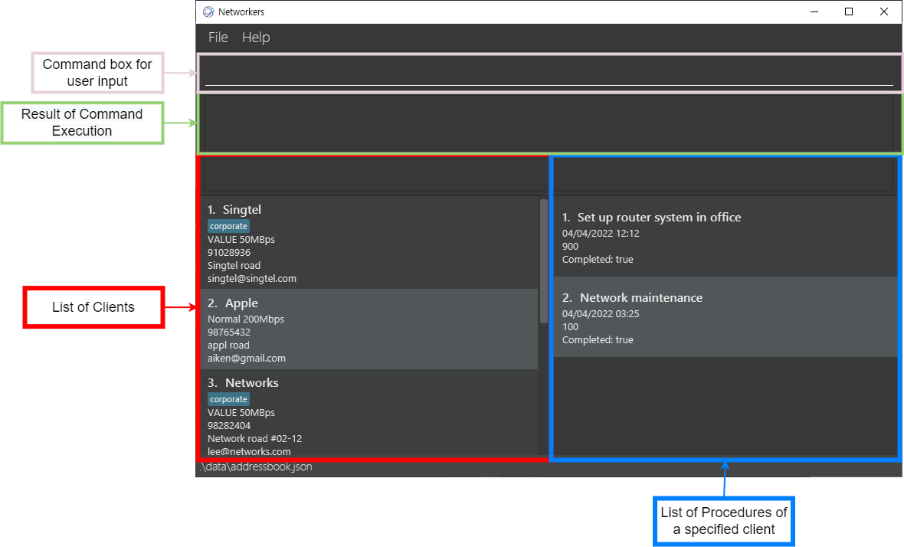

### Using the UI

To use our program, you need to type your commands into the command box as shown in the above image.
After typing, press Enter: if you enter a command with correct format and with valid inputs, 
it will execute the command, or else it will guide you towards rectifying the error.

> :bulb: **Tip:** The Procedures that belong to your first Client in the Client panel will display 
> on the Procedure panel upon loading the program!

## Features
The Features section will be generally further divided into the Format, Notes, and Examples subsections for each of the commands.
- The Format subsection discusses how the command should be structured when you type it on Command box.
- The Note subsection is an optional subsection that contains additional information about the command. It may not be related to the format of the command.
- The Example subsection is an optional subsection that illustrates how Networkers responds during and after executing the example commands.

### Notes about command formats:
- Words in `UPPER_CASE` refers to the parameters to be supplied by you.
  For example, in `addClient n/NAME`, `NAME` is a parameter that can be used as `addClient n/John Doe`.

- When more than 1 parameter from the user is required, parameters will be separated with the use of 
  flags, in the form of `x/xxxxx`
  For example, in the add command, since more than one parameter needs to be specified, the command takes
  the form of `n/NAME p/PHONE_NUMBER e/EMAIL a/ADDRESS l/PLAN [t/TAG]`. 

- Items in square brackets are optional.
  For example, `find KEYWORD [MORE_KEYWORDS]` can be used as `find Apple Inc`.

- Items with … after them can be used multiple times in a command, including zero times.
  e.g. [t/TAG]…  can be used as `t/` (i.e. 0 times), `t/new`, or `t/maintenance t/periodic` etc.

- Parameters can be in any order.
  e.g. if the command specifies n/NAME p/PHONE_NUMBER, p/PHONE_NUMBER n/NAME is also acceptable.

- If a parameter is expected only once in the command but you specified it multiple times, only the last occurrence of the parameter will be taken.
  e.g. if you specify p/12341234 p/56785678, only p/56785678 will be taken.

- All indexes are integer-based, in which the maximum value is 2147483647 (2<sup>31</sup> - 1), as specified by the Java language.


### Add a Client: `addClient`

Add your Client to Networkers. The Client will initially start off with an empty Procedure list.

**Format:** `addClient n/NAME p/PHONE_NUMBER e/EMAIL a/ADDRESS l/PLAN [t/TAG]...`
- `addClient` refers to the command of adding a Client.

- This command will not work if there exists another Client in your Networkers contact list with an identical, inclusive of whitespaces, ADDRESS attribute.
  - Having two whitespaces will be treated differently from having one whitespace.
- There exist some fields that are mandatory for this function. These fields include their name, phone number, email, address and a (subscription) plan.

**Note:** <br/>
- You can add any information for the plan attribute. This behaviour is intentional due to differences in formats adopted by different telecommunication companies.

> :bulb: **Tip:** Our User Guide uses PLAN NAME + BANDWIDTH for inserting plan attributes, such as Plan 50GBps. Feel free to customise to your own needs!

**Example:** <br/>
In Command box:
- `addClient n/Apple p/91234561 e/apple@example.com a/311, Bedok Ave 3, #01-15 l/Plan 50GBps t/corporate`
  - This triggers the addition of the Client to your Client Panel.
  - Result shows: `New client added: Apple; Phone: 91234561; Email: apple@example.com; Address: 311, Bedok Ave 3, #01-15; Plan: Plan 50GBps; Tags: [corporate]`

In Application: 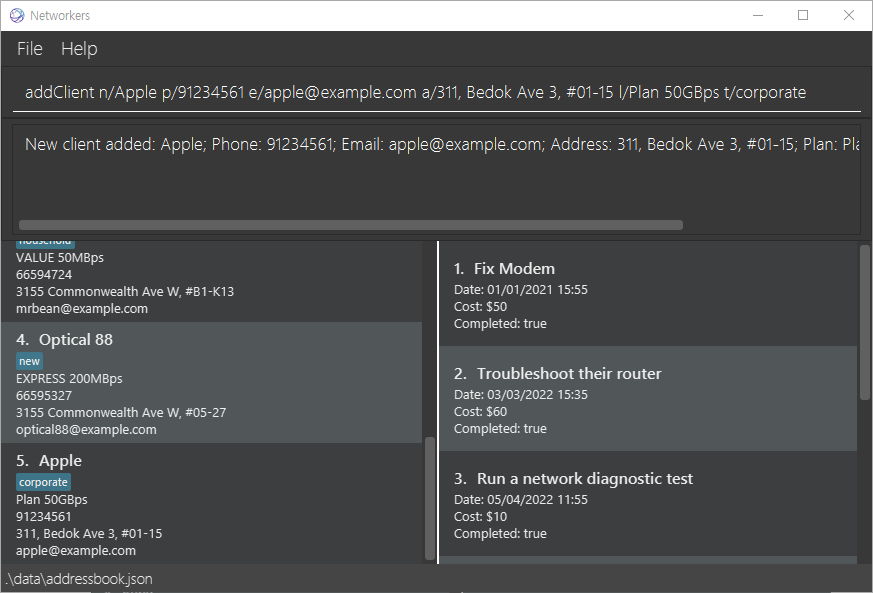

### Delete a Client: `deleteClient`

Deletes a specified Client in Networkers.

**Format:** `deleteClient <CLIENT INDEX>`
- `deleteClient` refers to the command of deleting an existing Client at the index specified in your Client Panel.
- `<CLIENT INDEX>` refers to the ordering number shown in your displayed Client Panel.
  - The index **must be** a positive integer 1, 2, 3, …

**Example:** <br/>
In Command box:
- `deleteClient 5` 
  - This triggers the deletion of the first Client in your Client Panel. 
  - ❗ When you delete a Client, the Procedures that are tagged to them will be deleted as well.
  - Result shows: `Deleted Client: Apple; Phone: 91234561; Email: apple@example.com; Address: 311, Bedok Ave 3, #01-15; Plan: Plan 50GBps; Tags: [corporate]`

In Application: 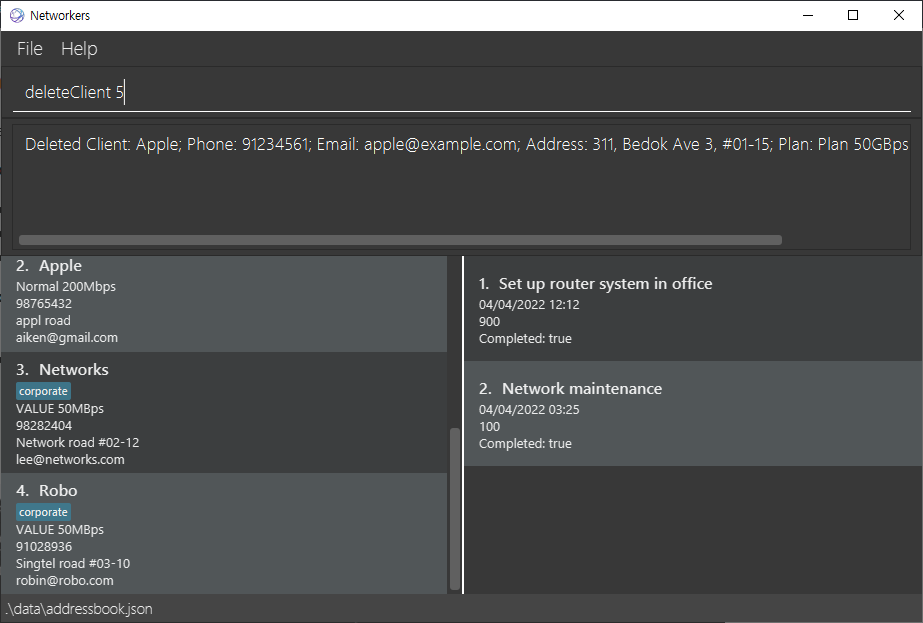

### Edit a Client: `edit`

Edits a specified Client in Networkers.

**Format:** `edit <CLIENT INDEX> [n/NAME] [p/PHONE] [e/EMAIL] [a/ADDRESS] [l/PLAN] [t/TAG]...`
- `edit` refers to the command of editing the detail of an existing Client at the index specified in your Client Panel.
- `<CLIENT INDEX>` refers to the index number shown in the displayed Client Panel. 
  - The index **must be** a positive integer 1, 2, 3, …
- `[n/NAME]` refers to an optional field for editing your Client's name.
- `[p/PHONE]` refers to an optional field for editing your Client's contact number.
- `[e/EMAIL]` refers to an optional field for editing your Client's email.
- `[a/ADDRESS]` refers to an optional field for editing your Client's address.
- `[l/PLAN]` refers to an optional field for editing your Client's subscription plan.
- `[t/TAG]` refers to an optional field for editing your Client's tag. 
  - You can remove all the person’s tags by typing t/ without specifying any tags after it.
- In order to trigger this command, at least one of the following fields must be edited: `name`, `phone`, `email`, 
`address`, `plan`, `tag`.
- This command will not allow for edit if there exists another Client in your Networkers contact list with an identical, inclusive of whitespaces, ADDRESS attribute.
  - Having two whitespaces will be treated differently from having one whitespace.

- ❗ Note that by editing your Client's details, you will be overwriting their existing data.

**Example:** <br/>
In Command box:
- `edit 4 n/Apple`
  - This triggers the editing of the indicated Client.
  - Result shows: `Edited Client: Apple; Phone: 66595327; Email: optical88@example.com; Address: 3155 Commonwealth Ave W, #05-27; Plan: EXPRESS 200MBps; Tags: [new]; Procedures: Information: Extend international warranty of modem; Date: 06/06/2022 12:25; Cost: $195.00; Completed: falseInformation: Back up their employee data to the cloud database; Date: 20/06/2022 09:55; Cost: $230.00; Completed: falseInformation: Inspect the network performance of their cash register; Date: 23/08/2022 13:15; Cost: $50.00; Completed: false`

In Application: 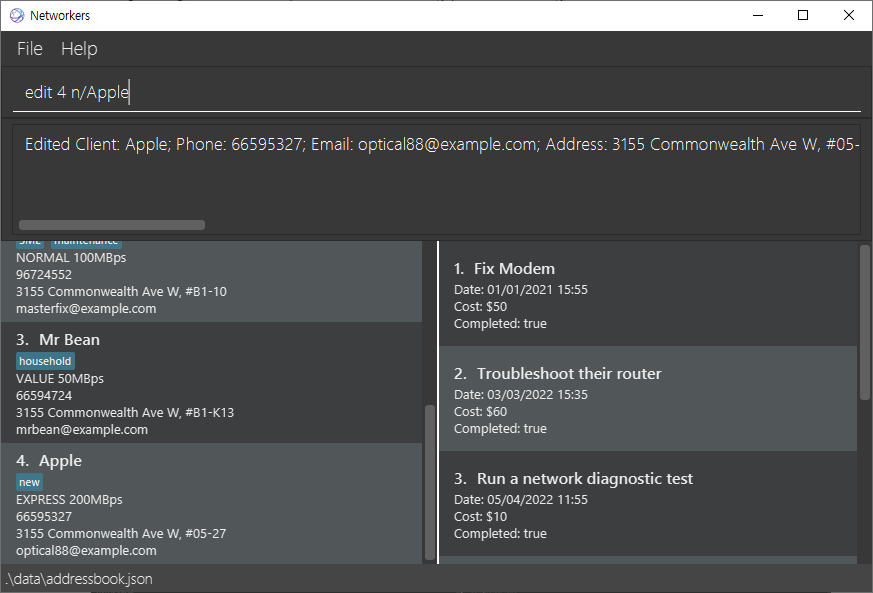

### Add a Procedure to a Client: `addProc`

Adds a specified Procedure to a specified Client in your displayed Client Panel.

**Format:** `addProc <CLIENT INDEX> i/INFORMATION c/COST d/DATE_TIME`
- `addProc` refers to the command of adding a Procedure to the Client at the specified index.
- `<CLIENT INDEX>` refers to the index number shown in the displayed Client Panel. 
  - The index **must be** a positive integer 1, 2, 3, …
- `INFORMATION` refers to the tasks or problems that need to be addressed on the Client’s business site.
  Blank input for this field will not be valid.
- `DATE_TIME` is the date and time that the Procedure takes place. It accepts inputs in the form of `dd/MM/YYYY HH:MM`, e.g. 20/03/2022 11:30.
- `COST` refers to the cost of Procedure that will be charged to your Client.
  It must be greater than $0 and less than $100 million dollars. 
  The rationale behind a cap for cost would be to prevent technicians from inputting numbers that are too large by accident.
  Contracts that technicians handle on a day-to-day basis are generally small scale and would be less than $100 million.
  
- If the specified Client already has an identical Procedure, the application will inform you that the Procedure has already been added.
  - An identical Procedure refers to a Procedure that contains the exact same information, date and time, and cost.

**Note:** <br/>
- If the Procedure Panel was showing the Procedures of another Client prior to executing this command, 
it will now show the Procedures of the Client that has a Procedure newly added.
- New Procedures will be auto-sorted, in ascending order, based on the date the Procedure will take place.
- It is valid to add Procedures that fall on the exact same date and time.
  - This is because some Procedures can be done concurrently through remote control.
- It is valid to add in Procedures that had occurred before.
  - This is because some technicians have mentioned that they need to add in past Procedures just for their own record.

**Example:** <br/>
In Command box:
- `addProc 1 i/Install modem c/10.5 d/20/03/2022 11:30`
  - This triggers the addition of a Procedure to the first Client.
  - Result shows: `New Procedure added: Information: Install modem; Date: 20/03/2022 11:30; Cost: $10.50; Completed: false`

In Application: 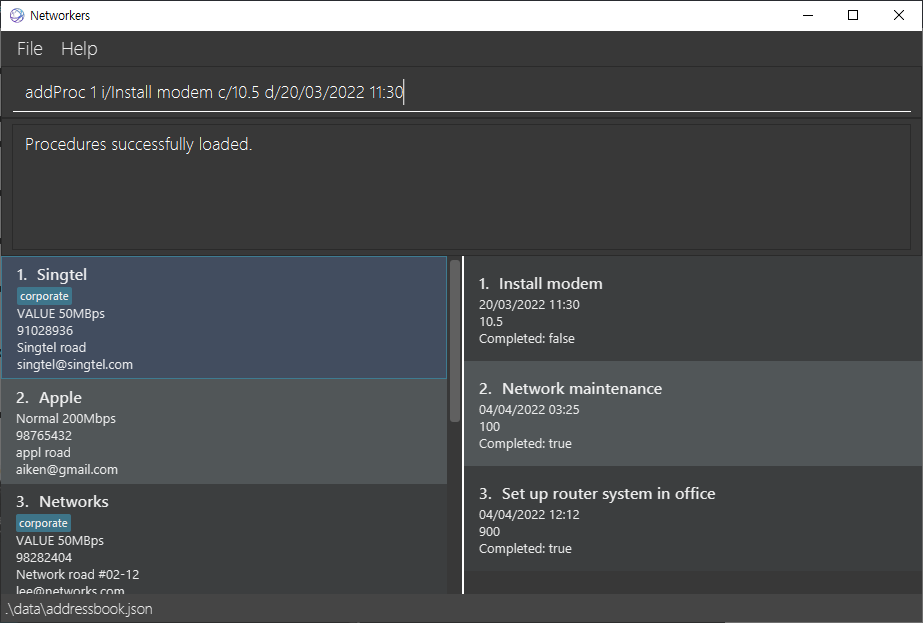

### Delete a Procedure from the Client: `deleteProc`

Deletes a Procedure associated with your Client. This is important as it allows you to maintain and make changes to the database.

**Format:** `deleteProc <CLIENT INDEX> <PROCEDURE INDEX>`
- `deleteProc` refers to the command of deleting a Procedure from the Client at the specified index.
- `<CLIENT INDEX>` refers to the index number shown in the displayed Client Panel. 
  - The index **must be** a positive integer 1, 2, 3, ...
- `<PROCEDURE INDEX>` refers to the index number shown in the displayed Procedure Panel. 
  - The index **must be** a positive integer 1, 2, 3, ...

**Note:** <br/>
- If the Procedure Panel was showing the Procedures of another Client prior to executing this command,
  it will now show the Procedures of the Client that has their Procedure deleted.

**Example:** <br/>
In Command box:
- `deleteProc 1 3`
  - Result shows: 
  `Deleted Procedure: Information: Run a network diagnostic test; Date: 05/04/2022 11:55; Cost: $10.00; Completed: true`

Before Command:

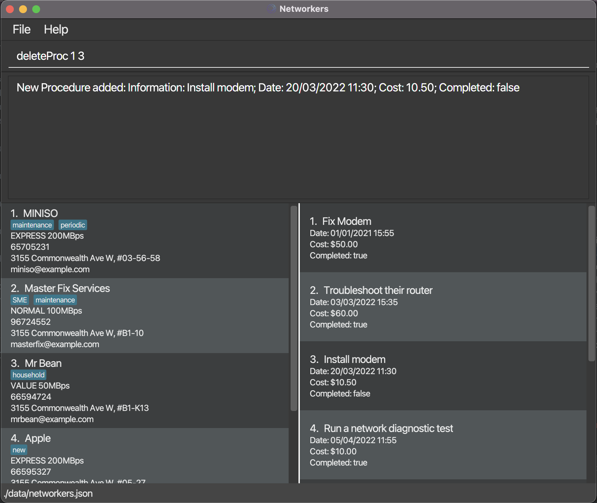

After Command:

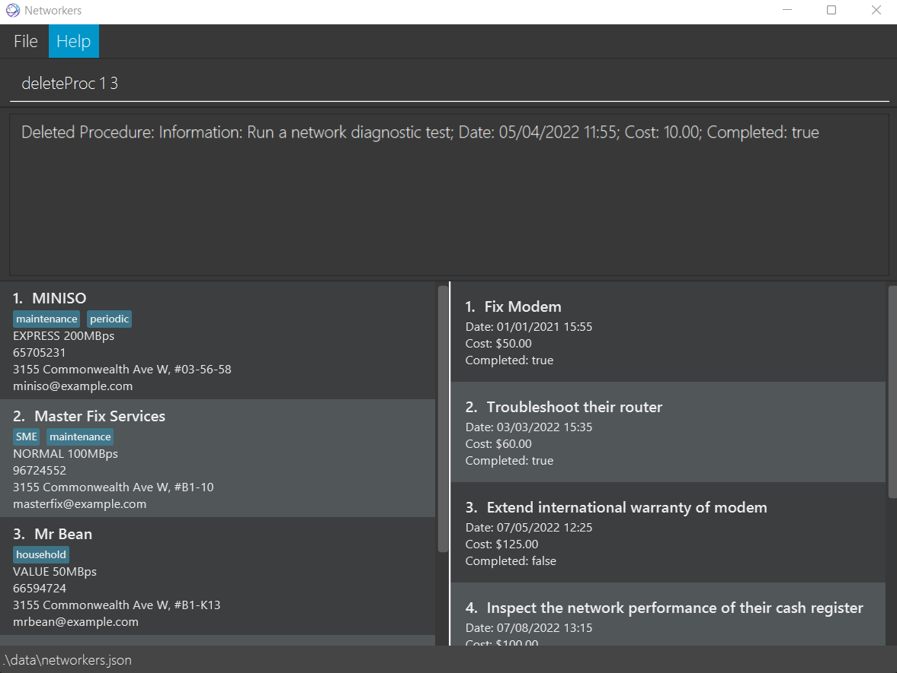

### Edit a Procedure of your Client: `editProc`

Edits an existing Procedure that belongs to an existing Client. This feature allows you to edit the main details related to the Procedure.
The main details include the information, the date and time, and the cost of the Procedure.

**Format:** `editProc <CLIENT INDEX> <PROCEDURE INDEX> [i/INFORMATION] [d/DATE_TIME] [c/COST]`
- `editProc` refers to the command of editing an existing Procedure from an existing Client.
- `<CLIENT INDEX>` refers to the ordering number of the Client displayed on the Client screen. 
  - The index **must be** a positive integer 1, 2, 3, ...
- `<PROCEDURE INDEX>` refers to the ordering number of the Procedure displayed on the Procedure screen (that is associated with a Client). 
  - The index **must be** a positive integer 1, 2, 3, ...
- `[i/INFORMATION]` refers to the informational detail of the Procedures in subsequent servicing trips.
  Blank input for this field will not be valid.
- `[d/DATE_TIME]` is the date and time that the Procedure takes place. It accepts inputs in the form of `dd/MM/YYYY HH:MM`, e.g. 20/03/2022 11:30.
- `[c/COST]` refers to the cost of Procedure that will be charged to your Client.
  It must be greater than $0 and less than $100 million dollars.
  The rationale behind a cap for cost would be to prevent technicians from inputting numbers that are too large by accident.
  Contracts that technicians handle on a day-to-day basis are generally small scale and would be less than $100 million.

- The `INFORMATION`, the `DATE_TIME`, or the `COST` field **must be** filled up for this command to run.
- If the Client already has an identical Procedure, the application will inform you that the Client already has this Procedure.
  - An identical Procedure refers to a Procedure that has the exact same information, date and time, and cost.

**Note:** <br/>
- After the Procedure is successfully edited, all procedures will be auto-sorted, in ascending order, based on the
    date the Procedure will take place.
- If the Procedure Panel was showing the Procedures of another Client prior to executing this command,
  it will now show the Procedures of the Client that has their Procedure deleted.

**Example:** <br/>
In Command box:
- `editProc 1 2 i/Fix Router d/31/03/2022 09:50 c/67.25`
  - Result shows: 
  `Edited Procedure: Information: Fix Router; Date: 31/03/2022 09:50; Cost: $67.25; Completed: true.
    From client: MINISO, at 3155 Commonwealth Ave W, #03-56-58.`

Before Command: 

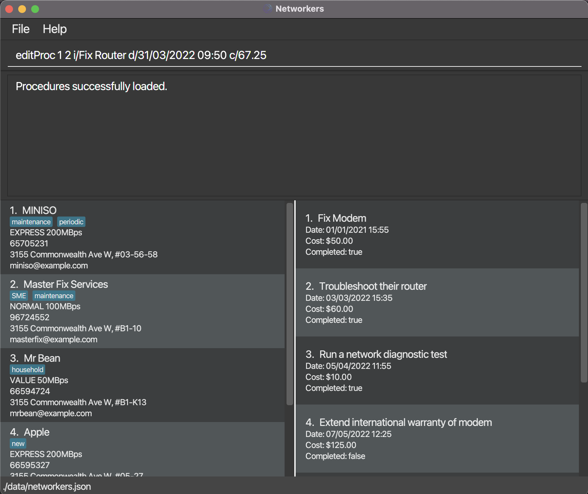

After Command:

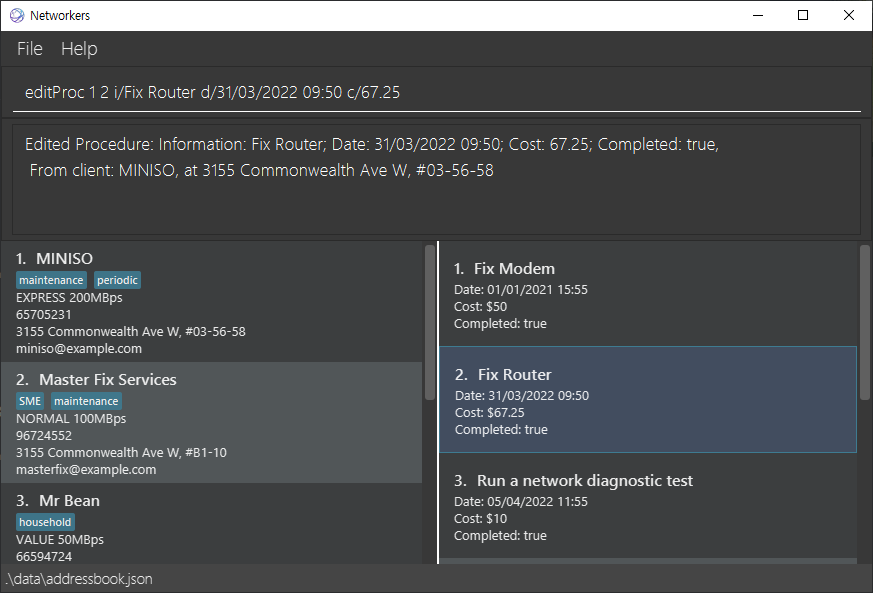

### View All Clients: `list`

Lists out all the Clients saved in your Networkers database. 
This feature is commonly used to list all the Clients after executing `find`. 
No secondary information is required.

**Format:** `list`
- `list` refers to the command to list all Clients saved in your database.

**Note:** <br/>
- After using the `find` command, you can use this feature to see all the Clients again.
- If this command is used after the `find` command, the Procedure Panel will feature the 
  Procedures from the previously found Client (if any).

**Example:** <br/>
In Command box:
- `list`
  - Result shows: `Listed all clients.`

In Application: 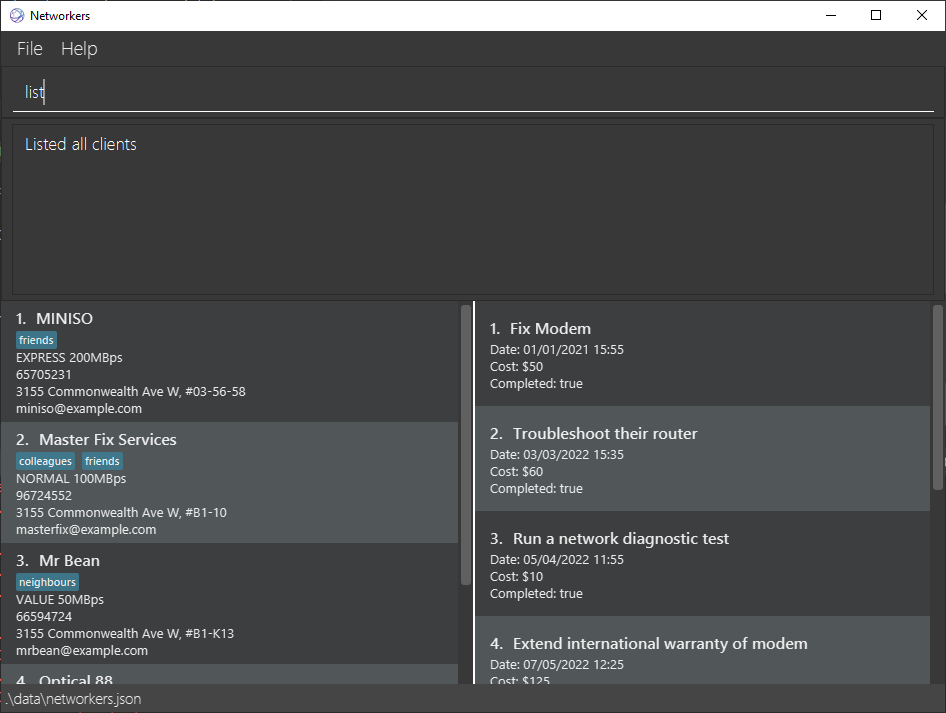

### View All Procedures of a Client: `listProc`

Lists out all the Procedures related to a Client.

**Format:** `listProc <CLIENT INDEX>`
- `listProc` refers to the command to list all the Procedures related to the specified, and existing, Client. 
- `<CLIENT INDEX>` refers to the ordering number of the Client displayed on the Client screen. 
  - The index **must be** a positive integer 1, 2, 3, ...

**Example:** <br/>
In Command box:
- `listProc 3`
  - Result shows: `Procedures successfully loaded.`

In Application: 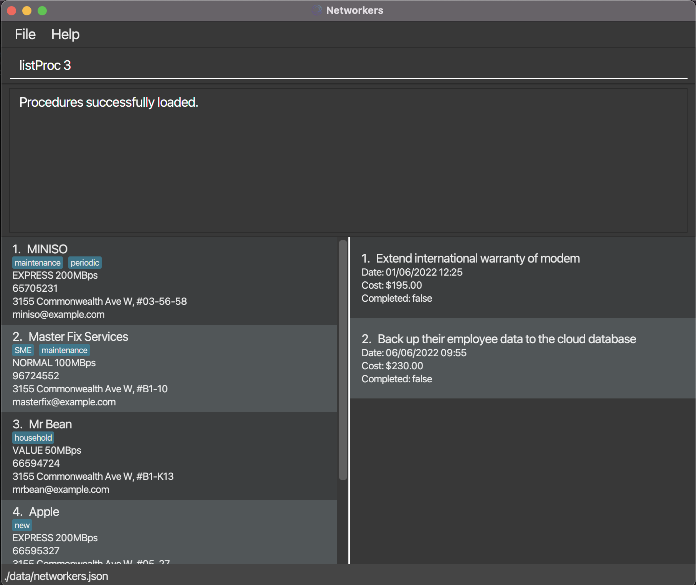

### View all Procedures scheduled on a specified date: `listProcOn`

Lists out all Procedures, including the associated Client as per Procedure, that are scheduled on a specified date.

**Format:** `listProcOn <DATE>`
- `listProcOn` refers to the command of listing out all Procedures on a specified date.
- `DATE` is in the format of dd/MM/YYYY, e.g. 26/03/2022.
  - An error will be thrown if the date is invalid.

**Example:** <br/>
In Command box:
- `listProcOn 06/06/2022`
  - Result shows: 
```
Listing Procedures on requested date:
1. Information: Back up their employee data to the cloud database; Date: 06/06/2022 09:55; Cost: $230.00; Completed: false
Master Fix Services, located at 3155 Commonwealth Ave W, #B1-10
2. Information: Back up their employee data to the cloud database; Date: 06/06/2022 09:55; Cost: $230.00; Completed: false
Mr Bean, located at 3155 Commonwealth Ave W, #B1-K13
3. Information: Extend international warranty of modem; Date: 06/06/2022 12:25; Cost: $195.00; Completed: false
Optical 88, located at 3155 Commonwealth Ave W, #05-27
```

In Application: 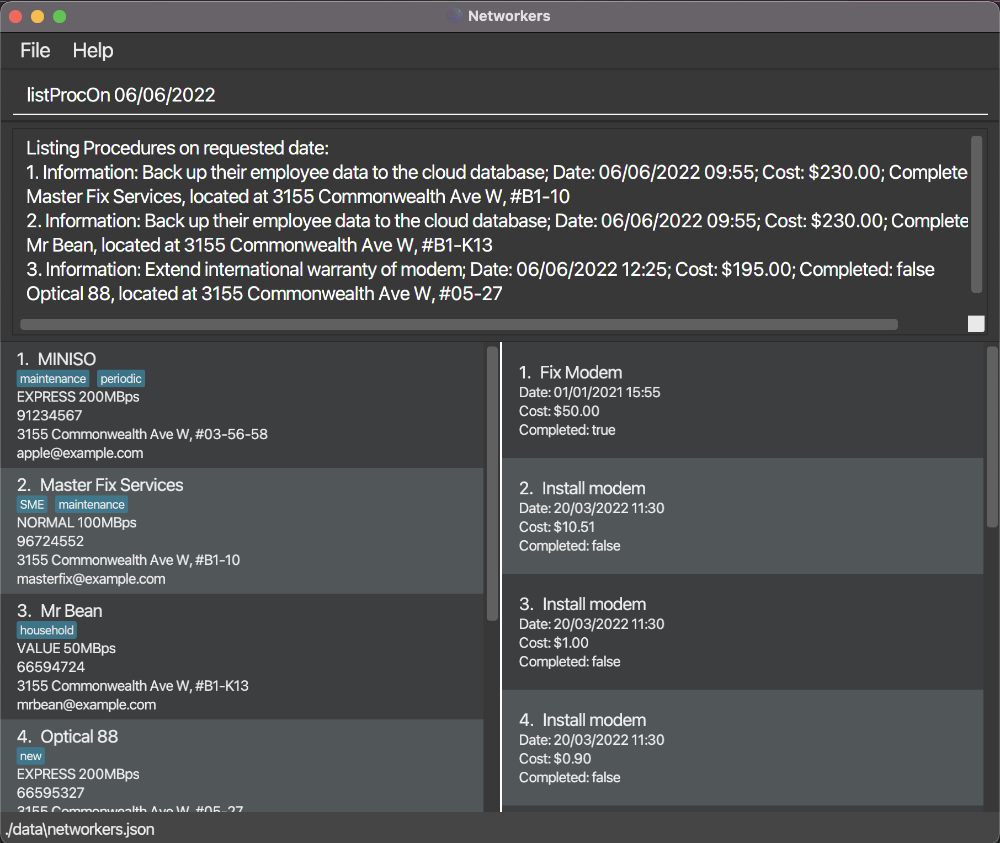

### Calculate the cost of all Procedures on a specified date: `calculate`

Calculates the cost of all Procedures that happen at any time on a specified date.

**Format:** `calculate <DATE>`
- `calculate` refers to the command of calculating the cost of all Procedures on a specified date.
- `DATE` is in the format of dd/MM/YYYY, e.g. 23/03/2022. 
  - An error will be thrown if the date is invalid.

**Example:** <br/>
In Command box:
- `calculate 06/06/2022`
  - Result shows: `Total Cost: $655.00`

In Application: 

### Marking a Procedure of a Client as Completed: `mark`

Marks the target Client's target Procedure as completed.

**Format:** `mark <CLIENT INDEX> <PROCEDURE INDEX>`
- `mark` refers to the command of marking a Procedure as completed.
- `<CLIENT INDEX>` refers to the ordering number of the Client displayed on the Client screen. 
  - The index **must be** a positive integer 1, 2, 3, ...
- `<PROCEDURE INDEX>` refers to the ordering number of the Procedure displayed on the Procedure screen. 
  - The index **must be** a positive integer 1, 2, 3, ...

**Example:**
In Command box:
- `mark 1 5`
    - Result shows: `Procedure successfully marked as complete.`

In Application: 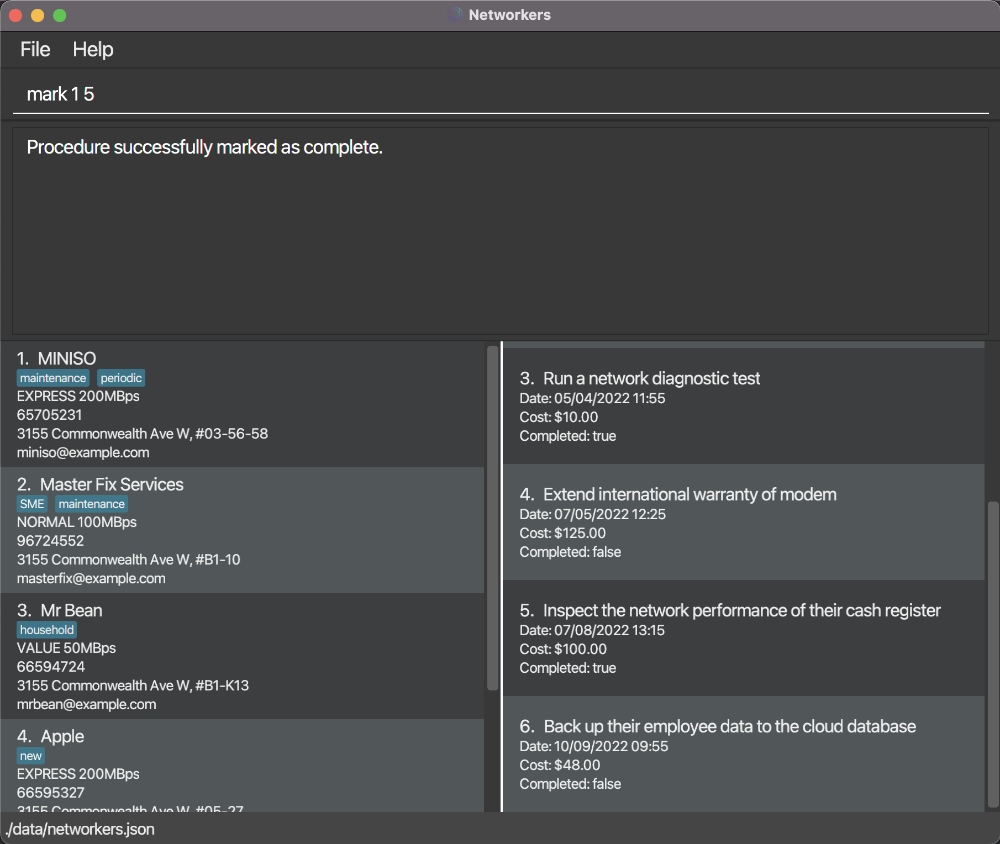

### Unmarking a Procedure of a Client: `unmark`

Marks the target Client's target Procedure as not complete.

**Format:** `unmark <CLIENT INDEX> <PROCEDURE INDEX>`
- `unmark` refers to the command of marking a Procedure as not completed.
- `<CLIENT INDEX>` refers to the ordering number of the Client displayed on the Client screen. 
  - The index **must be** a positive integer 1, 2, 3, ...
- `<PROCEDURE INDEX>` refers to the ordering number of the Procedure displayed on the Procedure screen. 
  - The index **must be** a positive integer 1, 2, 3, ...

**Example:**
In Command box:
- `unmark 1 5`
    - Result shows: `Procedure successfully unmarked.`

In Application: 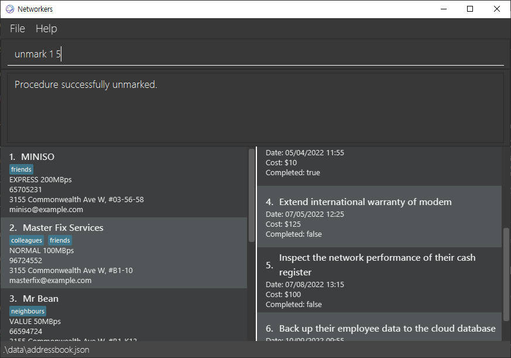

### Locating Clients by Name: `find`

Finds Clients whose names contain any of the given keywords.

**Format:** `find KEYWORD [MORE_KEYWORDS]`
- `find` refers to the command of finding Clients whose names fit the given keywords.
- The search is case-insensitive. e.g. `apple inc` will match `Apple Inc`
- The order of the keywords does not matter. e.g. `Inc Apple` will match `Apple Inc`
- Only the name is searched.
- Only full words will be matched e.g. `App` will not match `Apple Inc`
- Clients matching at least one keyword will be returned. e.g. `Inc` will return `Apple Inc`, `Google Inc`

**Example:** <br/>
In Command box:
- `find Fix`
  - Result shows: `1 client(s) listed!`
In Application: 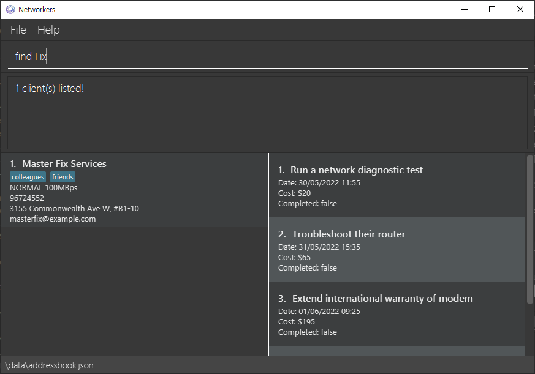

### Clear All Clients: `clear`

Clears all Clients and their respective Procedures currently recorded in Networkers.

**Format:** `clear`
- `clear` refers to the command of clearing all Clients and their respective Procedures in the application.

**Example:** <br/>
In Command box:
- `clear`
  - Result shows: `Address book has been cleared!`

In Application: 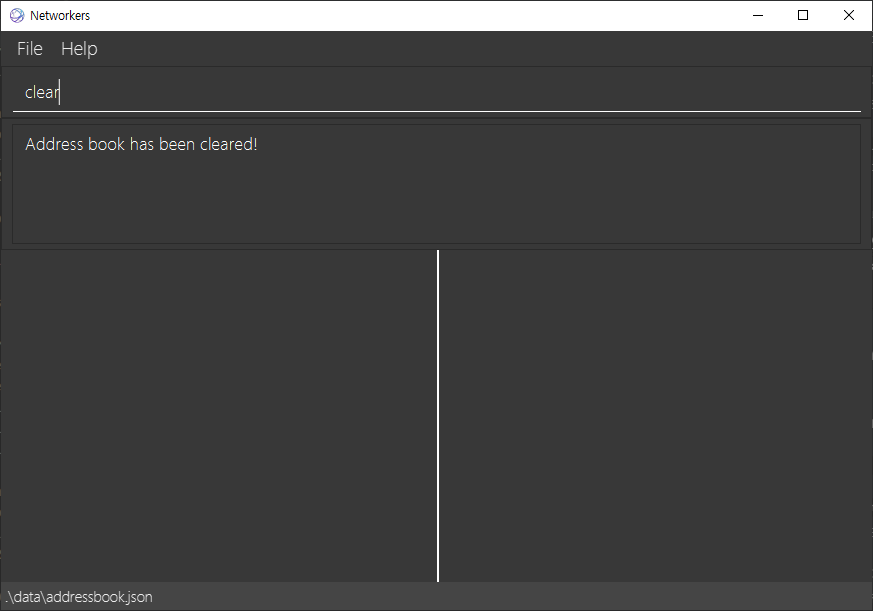

### Exiting the program: `exit`

Exits the program.

**Format**: `exit`

## Command Summary

| Command                                         | Syntax                                                                                    | Example                                                                                                 |
|-------------------------------------------------|-------------------------------------------------------------------------------------------|---------------------------------------------------------------------------------------------------------|
| Add Client                                      | `addClient n/NAME p/PHONE_NUMBER e/EMAIL a/ADDRESS l/PLAN [t/TAG]...`                     | `addClient n/Apple p/91234561 e/apple@example.com a/311, Bedok Ave 3, #01-15 l/Plan 50GBps t/corporate` |
| Delete Client                                   | `deleteClient <INDEX>`                                                                    | `deleteClient 1`                                                                                        |
| Edit Client                                     | `edit <CLIENT INDEX> [n/NAME] [p/PHONE_NUMBER] [e/EMAIL] [a/ADDRESS] [l/PLAN] [t/TAG]...` | `edit 1 n/Apple`                                                                                        |
| Add Procedure                                   | `addProc <CLIENT INDEX> i/INFORMATION c/COST d/DATE_TIME`                                 | `addProc 1 i/Install modem c/10.5 d/20/03/2022 11:30`                                                   |
| Delete Procedure                                | `deleteProc <CLIENT INDEX> <PROCEDURE INDEX>`                                             | `deleteProc 1 3`                                                                                        |
| Edit Procedure                                  | `editProc <CLIENT INDEX> <PROCEDURE INDEX> [i/INFORMATION] [d/DATE_TIME] [c/COST]`        | `editProc 1 2 i/Fix Router d/31/03/2022 09:50 c/67.25`                                                  |
| List All Clients                                | `list`                                                                                    | `list`                                                                                                  |
| List All Procedures of a Client                 | `listProc <CLIENT INDEX>`                                                                 | `listProc 1`                                                                                            |
| List All Procedures on Specified Date           | `listProcOn <DATE>`                                                                       | `listProcOn 23/05/2022`                                                                                 | 
| Calculate Cost of Procedures (on specific date) | `calculate <DATE>`                                                                        | `calculate 23/02/2022`                                                                                  |
| Clear All Clients                               | `clear`                                                                                   | `clear`                                                                                                 |
| Find Clients by Keyword                         | `find KEYWORD [MORE_KEYWORDS]...`                                                         | `find Apple Inc`                                                                                        |
| Mark Procedure as complete                      | `mark <CLIENT INDEX> <PROCEDURE INDEX>`                                                   | `mark 1 1`                                                                                              |
| Unmark completed Procedure                      | `unmark <CLIENT INDEX> <PROCEDURE INDEX>`                                                 | `unmark 1 1`                                                                                            |
| Exit program                                    | `exit`                                                                                    | `exit`                                                                                                  |

## FAQ

### Why is The Command Not Working?

There are several cases in which you might face errors when entering a command:

- Typing in the command word wrongly (e.g. typing `lisst` instead of `list`)
- Typing in wrong number of inputs (e.g. typing `deleteClient` or `deleteClient 5 2` instead of `deleteClient 2`)
- Typing in letters for numbers or vice versa (e.g. typing `listProc hello` instead of `listProc 1`)
- You entered the correct command but with invalid inputs (e.g. typing `deleteProc 1 10` when there is no 10th Client)

The corresponding error messages will be displayed in the result box, so do take a look at them.
