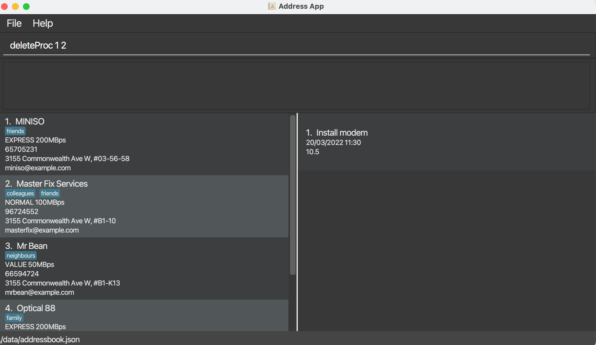

* Table of Contents
{:toc}
--------------------------------------------------------------------------------------------------------------------

*Networkers* is a **desktop app for managing contacts for networks,
optimised for use via a Command Line Interface** (CLI)
while still having the benefits of a Graphical User Interface (GUI).
If you can type fast, Networkers can get your contact management tasks
done faster than traditional GUI apps.

- **Features (v1.2)**
  1. Add a client
  2. Delete a client
  3. Add a procedure to the client
  4. Delete a procedure from the client
  5. View all clients and associated procedures in the client
  6. Calculate the cost of all procedures on a specified date
- **Command Summary**

--------------------------------------------------------------------------------------------------------------------

## Features

### Add a Client: `addClient`

Adds a Client with an empty procedure list to the address book

Format: `add n/NAME p/PHONE_NUMBER e/EMAIL a/ADDRESS l/PLAN [t/TAG]...`
 - `addClient` refers to the command of adding a client to the address book
 - Mandatory details include a name, phone_number, an address and a plan for the client

Examples:

Non GUI format:
- User: `addClient n/Apple p/91234561 e/apple@example.com a/311, Bedok Ave 3, #01-15 l/Plan 50GBps t/corporate `
  - Terminal returns: `New client added: Apple; Phone: 91234561; Email: apple@example.com; Address: 311, Bedok Ave 3, #01-15; Plan: Plan 50GBps; Tags: [corporate]`

GUI: 

### Deleting a client: `deleteClient`

Deletes a specified client from  the contact book.

Format: `deleteClient <INDEX>`

* Deletes the client at the specified INDEX.
* The index refers to the index number shown in the displayed contact list.
* The index must be a positive integer 1, 2, 3, …

Examples:

Non-GUI Format:
* `deleteClient 1` will trigger an attempt to delete the 1st client in the contact list .

GUI Format:

### Add a Procedure to a Client: `addProc`

Adds a specified procedure to a specified client list in the contact book.

**Format:** `addProc <Client Index> i/INFORMATION c/COST d/DATE_TIME`
* `addProc` refers to the command of adding a procedure to the client at the specified Index.
* `<Client Index>` refers to the index number shown in the displayed client list. The index **must be** a positive integer 1, 2, 3, …​
* `INFORMATION` refers to the tasks or problems that need to be addressed in the future visits to the client’s business sight.
  * Note that a client’s list of procedures is a numbered list. A new procedure will be added on to the existing numbered list (to the last index).
* `COST` is the cost required for the procedure
* `DATE_TIME` is the date and time that the procedure takes place.
  * The `DATE_TIME` accepts inputs in the form of `dd_MM_YYYY HH:MM`.

**Example:**  
Non-GUI Format:
* `addProc 1 i/Install modem c/10.5 d/20/03/2022 11:30`
  * In this case, if the 1st client already has existing procedure (written in the exact form as before), the application will inform the user that the Procedure has already been added.

GUI Format:

### Delete a Procedure from the client: `deleteProc`

Deletes a procedure associated with the client. This is important as it allows the user to maintain and make changes to the database - creation and deletion.

**Format:** `deleteProc <clientIndex> <Proc_Index>`
A procedure will be deleted from the existing numbered list.
* `deleteProc` refers to the command of deleting a procedure from the client at the specified Index.
* `<Client Index>` refers to the index number shown in the displayed client list. 
The index must be a positive integer 1, 2, 3, ...
* `<Procedure>` refers to the tasks or problems that need to be addressed
in the future visits to the client’s business sight.
Note that a client’s list of procedures is a numbered list.

**Example:**

Non-GUI format:

User: deleteProc 1 3

Terminal returns: `Current Procedure List: [Information: Install modem; Date: 20/03/2022 11:30; Cost: 10.5; Completed: false]`

User: deleteProc 3 500
Terminal returns: `The procedure index provided is invalid`

GUI Format:

Before Command:

After Command:

### Calculate the cost of all procedures on a specified date: `calculate`

Calculates the cost of all procedures that happen any time on a specified date 
in the format of dd/MM/uuuu, eg. 23/03/2022

Format: `calculate 23/03/2022`
- `calculate` refers to the command of calculating cost on a specified date
- Mandatory details include a valid date

Valid date:
A valid date has to 
1. be in the specified format of **dd/MM/uuuu** 
2. be an accurate date, taking leap years into account 

User will be prompted if the date is invalid

Example: 
- User: `calculate 23/03/2022`
- Terminal returns: 

Non-GUI Format

Total Cost: 31.50 

GUI Format:

### View All Clients: `list`

Lists out all the clients saved.
This feature will be used to show clients on GUI. No arguments required.
Example:
- User: `list`
- Terminal returns:

Non-GUI Format
1. Apple, 9XXXXXXX, Apple Road
2. Singtel, 8XXXXXXX, Singtel Road

GUI Format:

### View All Procedures of a Client: `listProc`

Lists out all the procedures related to a Client.

Example:
- User: `listProc 1`
- Terminal returns:

Non-GUI Format
1. Apple, 9XXXXXXX, Apple Road
    1. Fixed the intranet issue
    2. Replace router in 3rd floor

GUI Format

## Command Summary

| Command | Syntax                                                    | Example                                                  |
| --- |-----------------------------------------------------------|----------------------------------------------------------|
| Add Client | `addClient n/<NAME> p/<PHONE_NUMBER> a/<ADDRESS> l/<PLAN>` | `addClient n/Apple Inc p/9XXXXXXX a/apple road l/50MBps` |
| Delete Client | `deleteClient <INDEX>`                                    | `deleteClient 1`                                         |
| Add Procedure | `addProc <Client Index> i/INFORMATION c/COST d/DATE_TIME`                     | `addProc 1 i/Install modem c/10.5 d/20/03/2022 11:30`     |
| Delete Procedure | `deleteProc <CLIENT INDEX> <PROCEDURE INDEX>`             | `deleteProc 1 3`                                         |
| List All Clients | `list`                                                    | `list`                                                   |
| List All Procedures | `listProc <CLIENT INDEX>`                                 | `listProc 1`                                             | 
