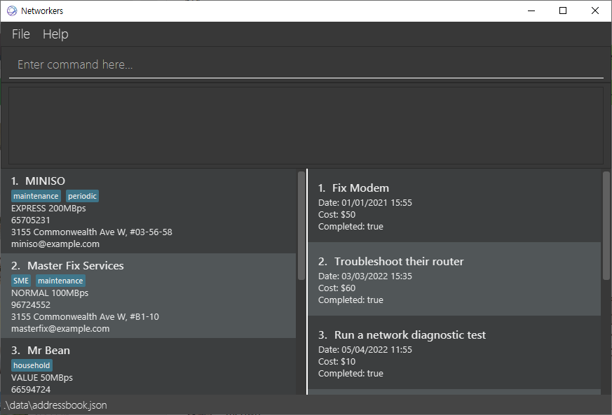

**Networkers is a desktop application to assist network technicians in managing their client details and relevant preparation for future servicings.** In addition to having the benefits of a Graphical User Interface (GUI), it is also optimised for use with a Command Line Interface (CLI).

* If you are interested in using Networkers, head over to the [_Quick Start_ section of the **User Guide**](UserGuide.html#quick-start).
* If you are interested in developing Networkers, the [**Developer Guide**](DeveloperGuide.html) is a good place to start.

**Acknowledgements**

* Libraries used: [JavaFX](https://openjfx.io/), [Jackson](https://github.com/FasterXML/jackson), [JUnit5](https://github.com/junit-team/junit5)
