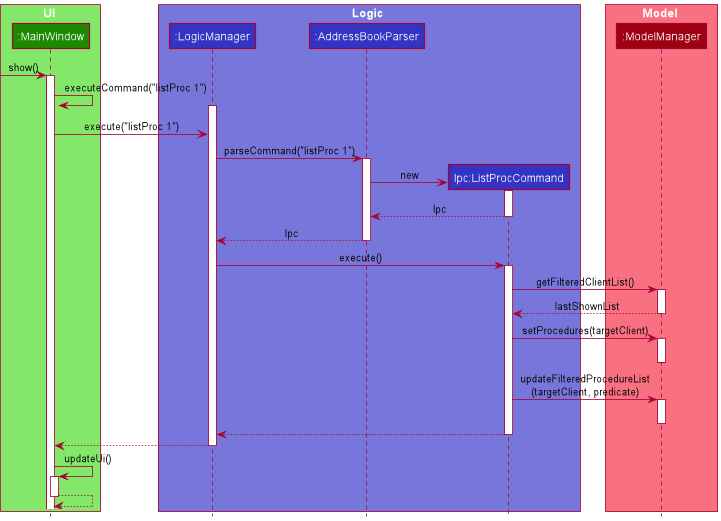
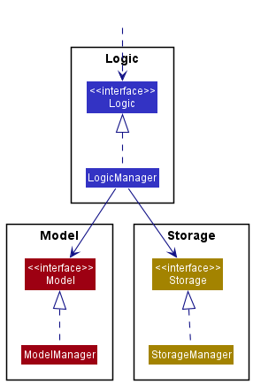

## Project Overview: Networkers
### Overview

Networkers is a desktop address book application used for teaching Software Engineering principles. 
The user interacts with it using a CLI, and it has a GUI created with JavaFX. 
It is written in Java, and has about 10 kLoC.

Below are my contributions to the project.

### Summary of my contributions

- **Code contributed:** [My Contribution](https://nus-cs2103-ay2122s2.github.io/tp-dashboard/?search=&sort=groupTitle&sortWithin=title&timeframe=commit&mergegroup=&groupSelect=groupByRepos&breakdown=true&checkedFileTypes=docs~functional-code~test-code~other&since=2022-02-18&tabOpen=true&tabType=authorship&tabAuthor=robinrojh&tabRepo=AY2122S2-CS2103T-W13-1%2Ftp%5Bmaster%5D&authorshipIsMergeGroup=false&authorshipFileTypes=docs~functional-code~test-code~other&authorshipIsBinaryFileTypeChecked=false)
- **Pull Requests created by me:** [PR](https://github.com/AY2122S2-CS2103T-W13-1/tp/pulls?q=is%3Apr+assignee%3Arobinrojh+)

#### Enhancements implemented:

- `listProc` Command
    - Added test cases
- Handle UI-related problems and enhancements
    - Divided the UI into two columns, one for Clients and another for Procedures
    - Display the whether a Procedure is completed
- Mark and Unmark Command
    - Allowed users to mark and unmark a procedure as complete
    - Reflect changes in `completed` field of the Procedure
- JsonAdaptedProcedure
    - Created the JsonAdaptedProcedure to store Procedures as a json
- Single-worded Command Parsing and Validation
    - Prevented single-worded commands like `help` and `exit` to throw error messages

#### Contributions to the UG

- Section: **View All Clients: `list`**
- Section: **View All Procedures of a Client: `listProc`**
    - Added an overview of the method
    - Added sequence diagram and design consideration
- Small Sections: **Clear, Exit**
- Command Summary Table Maintenance

#### Contributions to the DG

- Section: **List Procedures By Client (ListProc)**
- Architecture sequence diagram maintenance
- User stories for `list` and `listProc` Command
- Some Non-Functional Requirements (NFR)
- Section: Appendix updated to match current version

#### Contributions to team-based tasks

- Created team repository and setup GitHub pages with Jekyll
- Participated in weekly meetings to receive & provide feedback and decide next steps

#### Review/mentoring contributions

- [Pull Requests Reviewed by me](https://github.com/AY2122S2-CS2103T-W13-1/tp/pulls?q=is%3Apr+reviewed-by%3Arobinrojh+)

#### Excerpts from DG

- ListProc Sequence Diagram:

- Colors for Component Managers:

